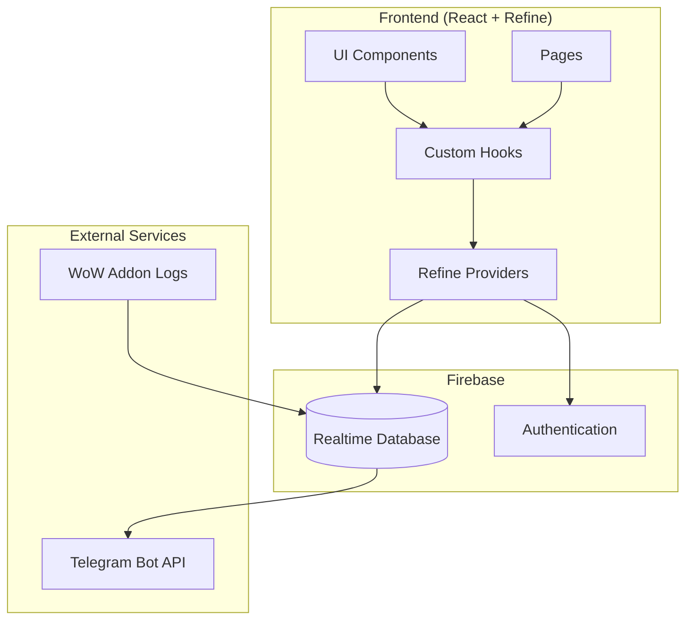
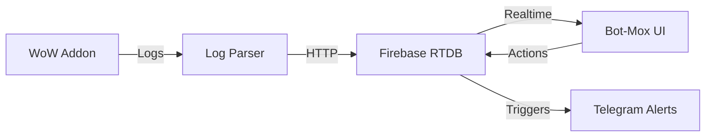
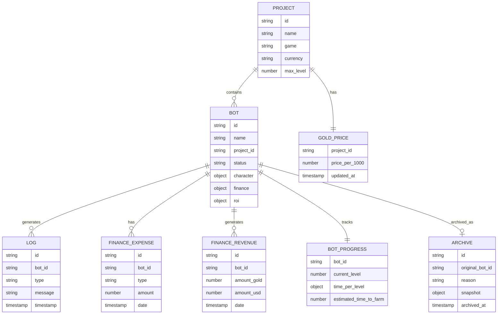
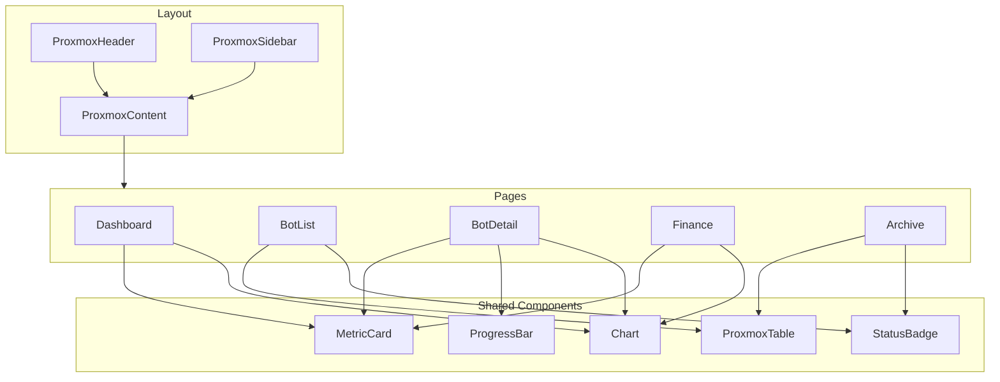
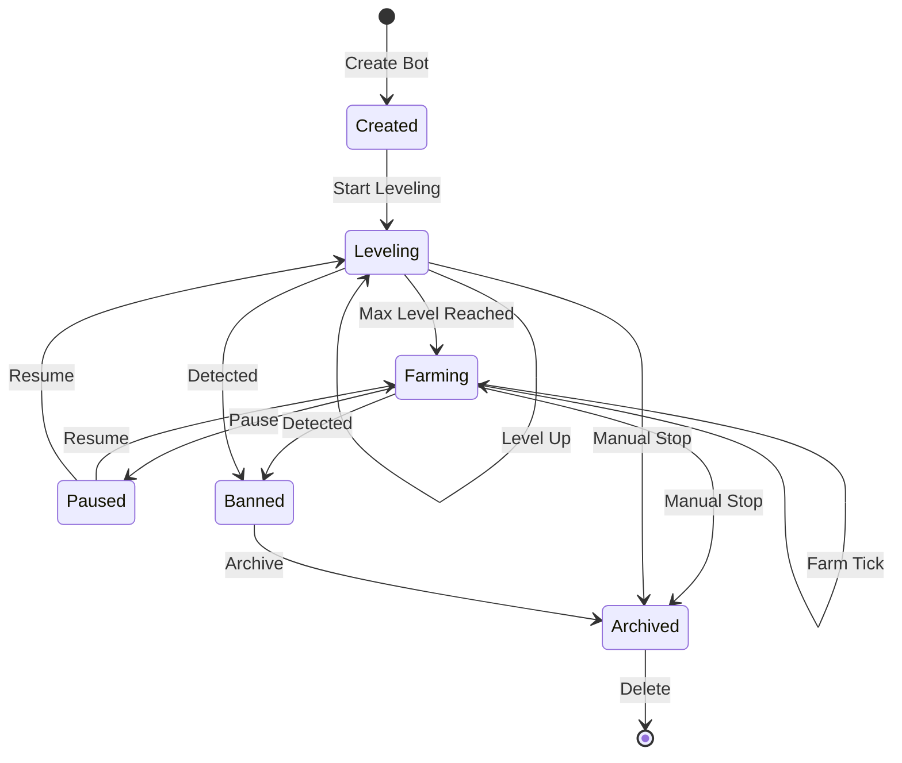

# Bot-Mox Architecture Document

## Содержание
1. [Обзор проекта](#1-обзор-проекта)
2. [Архитектура приложения](#2-архитектура-приложения)
3. [UI/UX Дизайн](#3-uiux-дизайн)
4. [Схема Firebase Realtime Database](#4-схема-firebase-realtime-database)
5. [Структура страниц и маршрутов](#5-структура-страниц-и-маршрутов)
6. [Интеграция с Refine](#6-интеграция-с-refine)
7. [Диаграммы](#7-диаграммы)

---

## 1. Обзор проекта

### 1.1 Назначение
**Bot-Mox** — админ-панель для управления игровыми ботами (WoW, PoE, TBC, Midnight и др.), вдохновлённая дизайном Proxmox VE. Система обеспечивает мониторинг, финансовый учёт и аналитику ROI.

### 1.2 Целевая аудитория
- Администраторы бот-ферм
- Операторы игровых ботов
- Финансовые аналитики

### 1.3 Масштаб
- **Активные боты**: 10-20 одновременно
- **Архив банов**: неограниченно
- **Проекты**: WoW, PoE, TBC WoW, Midnight и др.
- **Пользователи**: 2-3 администратора

### 1.4 Технологический стек
| Компонент | Технология |
|-----------|------------|
| Frontend | React 18 + TypeScript |
| Framework | Refine (v4+) |
| UI Library | Ant Design |
| Database | Firebase Realtime Database |
| State Management | React Query (встроен в Refine) |
| Стили | CSS Modules + CSS Variables |
| Уведомления | Telegram Bot API |

---

## 2. Архитектура приложения

### 2.1 Структура папок

```
Bot-Mox/
├── public/
│   ├── index.html
│   └── favicon.ico
├── src/
│   ├── components/           # Переиспользуемые компоненты
│   │   ├── common/          # Общие компоненты
│   │   │   ├── StatusBadge/
│   │   │   ├── MetricCard/
│   │   │   ├── ProxmoxTable/
│   │   │   └── Chart/
│   │   ├── layout/          # Компоненты layout
│   │   │   ├── Header/
│   │   │   ├── Sidebar/
│   │   │   └── Content/
│   │   └── forms/           # Формы
│   │       ├── BotForm/
│   │       ├── ProjectForm/
│   │       └── SettingsForm/
│   ├── pages/               # Страницы приложения
│   │   ├── dashboard/
│   │   ├── bots/
│   │   ├── projects/
│   │   ├── finance/
│   │   ├── archive/
│   │   ├── logs/
│   │   └── settings/
│   ├── hooks/               # Custom React hooks
│   │   ├── useBotStatus.ts
│   │   ├── useFinance.ts
│   │   └── useRealtime.ts
│   ├── providers/           # Refine providers
│   │   ├── data-provider.ts
│   │   ├── auth-provider.ts
│   │   └── notification-provider.ts
│   ├── contexts/            # React contexts
│   │   ├── ThemeContext.tsx
│   │   └── ProjectContext.tsx
│   ├── types/               # TypeScript types
│   │   ├── bot.ts
│   │   ├── project.ts
│   │   ├── finance.ts
│   │   └── index.ts
│   ├── utils/               # Утилиты
│   │   ├── calculations.ts  # ROI, окупаемость
│   │   ├── formatters.ts    # Форматирование
│   │   └── validators.ts
│   ├── constants/           # Константы
│   │   ├── colors.ts        # Proxmox цвета
│   │   ├── routes.ts
│   │   └── config.ts
│   ├── styles/              # Глобальные стили
│   │   ├── global.css
│   │   ├── proxmox-theme.css
│   │   └── variables.css
│   ├── App.tsx
│   └── index.tsx
├── Assets/                  # Существующие ресурсы
│   ├── firebase-key.json
│   ├── style.css           # Базовые Proxmox стили
│   └── *.csv               # Тестовые данные
└── firebase.json           # Firebase конфигурация
```

### 2.2 Компонентная иерархия

```
App
├── Refine
│   ├── AuthProvider
│   ├── DataProvider
│   ├── NotificationProvider
│   └── Layout
│       ├── ProxmoxHeader      # Фиксированный заголовок
│       ├── ProxmoxSidebar     # Навигация
│       └── ProxmoxContent     # Основной контент
│           ├── DashboardPage
│           ├── BotListPage
│           ├── BotDetailPage
│           ├── ProjectListPage
│           ├── FinancePage
│           ├── ArchivePage
│           ├── LogsPage
│           └── SettingsPage
```

### 2.3 State Management

Используется **React Query** (встроен в Refine):

| Сущность | Кэш-ключ | Инвалидация |
|----------|----------|-------------|
| Bots | `['bots']` | При изменении статуса |
| Bot Detail | `['bots', id]` | При обновлении бота |
| Projects | `['projects']` | Редко |
| Finance | `['finance']` | Ежедневно |
| Logs | `['logs']` | При новых записях |
| Gold Price | `['gold-price']` | При ручном обновлении |

**Realtime подписки** через Firebase onValue:
- Статус ботов (`/bots/{id}/status`)
- Метрики фарма (`/bots/{id}/metrics`)
- Логи (`/logs`)

---

## 3. UI/UX Дизайн

### 3.1 Цветовая схема (Proxmox Style)

```css
:root {
  /* Основные цвета */
  --proxmox-bg-primary: #383b40;      /* Фон приложения */
  --proxmox-bg-secondary: #282a2e;    /* Sidebar, header */
  --proxmox-bg-tertiary: #42464d;     /* Карточки, панели */
  --proxmox-bg-hover: #4a4e55;        /* Hover состояние */
  
  /* Акценты */
  --proxmox-accent: #e57000;          /* Оранжевый акцент */
  --proxmox-accent-hover: #ff8c1a;    /* Hover акцента */
  --proxmox-accent-light: #ffa94d;    /* Светлый акцент */
  
  /* Текст */
  --proxmox-text-primary: #efefef;    /* Основной текст */
  --proxmox-text-secondary: #bbb;     /* Вторичный текст */
  --proxmox-text-muted: #888;         /* Приглушённый */
  
  /* Статусы */
  --proxmox-status-online: #4caf50;   /* Онлайн */
  --proxmox-status-offline: #757575;  /* Офлайн */
  --proxmox-status-warning: #ff9800;  /* Предупреждение */
  --proxmox-status-error: #f44336;    /* Ошибка/Бан */
  --proxmox-status-info: #2196f3;     /* Информация */
  
  /* Границы */
  --proxmox-border: #444;
  --proxmox-border-light: #555;
  --proxmox-border-dark: #111;
}
```

### 3.2 Типографика

```css
:root {
  /* Шрифты */
  --font-primary: 'Roboto', 'Segoe UI', sans-serif;
  --font-condensed: 'Roboto Condensed', sans-serif;
  --font-mono: 'Roboto Mono', monospace;
  
  /* Размеры */
  --text-xs: 11px;    /* Labels, badges */
  --text-sm: 12px;    /* Secondary text */
  --text-base: 13px;  /* Body text */
  --text-md: 14px;    /* Emphasis */
  --text-lg: 16px;    /* Headers */
  --text-xl: 20px;    /* Metric values */
  --text-2xl: 24px;   /* Page titles */
}
```

### 3.3 Layout структура

```
┌─────────────────────────────────────────────────────────────┐
│  [LOGO]  Bot-Mox    [Search...]              [User] [⚙]   │  ← Header (45px)
├──────────┬──────────────────────────────────────────────────┤
│          │                                                  │
│  🏠      │              Main Content Area                   │
│ Dashboard│                                                  │
│          │  ┌──────────────────────────────────────────┐   │
│  🤖      │  │  Metric Cards Row                        │   │
│ Bots     │  └──────────────────────────────────────────┘   │
│          │                                                  │
│  📁      │  ┌──────────────────┐  ┌──────────────────┐   │
│ Projects │  │   Chart/Graph    │  │   Status Panel   │   │
│          │  └──────────────────┘  └──────────────────┘   │
│  💰      │                                                  │
│ Finance  │  ┌──────────────────────────────────────────┐   │
│          │  │         Data Table / List               │   │
│  📦      │  └──────────────────────────────────────────┘   │
│ Archive  │                                                  │
│          │                                                  │
│  📋      │                                                  │
│ Logs     │                                                  │
│          │                                                  │
│  ⚙️      │                                                  │
│ Settings │                                                  │
│          │                                                  │
└──────────┴──────────────────────────────────────────────────┘
     ↑
  Sidebar (260px)
```

### 3.4 Ключевые UI компоненты

#### 3.4.1 Metric Card (как в Proxmox)
```
┌─────────────────────────────┐
│  TOTAL BOTS                 │  ← Label (11px, uppercase, #bbb)
│  18                         │  ← Value (20px, bold, #fff)
│  ████████░░ 80% online      │  ← Progress bar + text
└─────────────────────────────┘
Background: #42464d
Border: 1px solid #555
Border-radius: 0
Padding: 12px
```

#### 3.4.2 Status Badge
```
┌─────────────┐  ┌─────────────┐  ┌─────────────┐  ┌─────────────┐
│ ● ONLINE    │  │ ● OFFLINE   │  │ ● FARMING   │  │ ● BANNED    │
│  #4caf50    │  │  #757575    │  │  #e57000    │  │  #f44336    │
└─────────────┘  └─────────────┘  └─────────────┘  └─────────────┘
```

#### 3.4.3 Data Table (Proxmox стиль)
```
┌─────────────────────────────────────────────────────────────────┐
│ ▼ Name      │ Status  │ Project  │ Level  │ Farm/Hour  │ ROI   │
├─────────────────────────────────────────────────────────────────┤
│ Bot-001     │ ● Online│ WoW TBC  │ 60     │ 125g       │ 145%  │
│ Bot-002     │ ● Farm  │ PoE      │ 85     │ 45c        │ 89%   │
│ Bot-003     │ ● Banned│ WoW      │ 42     │ -          │ 32%   │
├─────────────────────────────────────────────────────────────────┤
│ Showing 1-3 of 20                    [Prev] [1] [2] [3] [Next] │
└─────────────────────────────────────────────────────────────────┘

- Header: #282a2e, border-bottom: 2px solid #e57000
- Row hover: #4a4e55
- Selected row: border-left: 3px solid #e57000
```

#### 3.4.4 Progress Bar (Level/Progress)
```
Level 45/60:
┌────────────────────────────────────────┐
│████████████████████░░░░░░░░░░░░░░ 75% │
└────────────────────────────────────────┘
Height: 8px, Border-radius: 0
Fill: #e57000, Background: #282a2e
```

---

## 4. Схема Firebase Realtime Database

### 4.1 Общая структура

```json
{
  "projects": { /* Проекты игр */ },
  "bots": { /* Активные боты */ },
  "archive": { /* Забаненные боты */ },
  "finance": { /* Финансовые данные */ },
  "gold_prices": { /* История цен золота */ },
  "logs": { /* Логи активности */ },
  "users": { /* Пользователи системы */ },
  "settings": { /* Настройки системы */ }
}
```

### 4.2 Детальная схема

#### 4.2.1 Projects (Проекты)
```json
{
  "projects": {
    "wow_tbc": {
      "id": "wow_tbc",
      "name": "WoW TBC Classic",
      "game": "World of Warcraft",
      "expansion": "The Burning Crusade",
      "currency": "gold",
      "currency_symbol": "g",
      "max_level": 70,
      "professions": ["mining", "herbalism", "skinning", "enchanting"],
      "created_at": 1700000000000,
      "updated_at": 1700000000000
    },
    "poe": {
      "id": "poe",
      "name": "Path of Exile",
      "game": "Path of Exile",
      "expansion": "Settlers of Kalguur",
      "currency": "chaos",
      "currency_symbol": "c",
      "max_level": 100,
      "professions": ["mapping", "delving", "heist"],
      "created_at": 1700000000000,
      "updated_at": 1700000000000
    }
  }
}
```

#### 4.2.2 Bots (Активные боты)
```json
{
  "bots": {
    "bot_001": {
      "id": "bot_001",
      "name": "TBC-Miner-01",
      "project_id": "wow_tbc",
      "status": "farming", /* online, offline, farming, leveling, paused, error */
      
      /* Профиль бота */
      "character": {
        "name": "FarmBot01",
        "level": 68,
        "profession": "mining",
        "profession_level": 350,
        "race": "orc",
        "class": "warrior",
        "server": "Gehennas"
      },
      
      /* Прогресс прокачки */
      "progress": {
        "current_level": 68,
        "target_level": 70,
        "level_start_time": 1700000000000,
        "time_per_level": {
          "60": 7200000,
          "61": 6800000,
          "62": 7500000
        },
        "estimated_time_to_farm": 14400000
      },
      
      /* Финансовые метрики */
      "finance": {
        "total_farmed": 15000,
        "total_farmed_currency": "gold",
        "session_start": 1700000000000,
        "farm_per_hour": 125.5,
        "total_earned_usd": 187.50,
        "costs": {
          "proxy": 15.00,
          "subscription": 25.00,
          "session": 5.00
        }
      },
      
      /* ROI расчёты */
      "roi": {
        "total_invested": 120.00,
        "total_returned": 187.50,
        "roi_percent": 156.25,
        "payback_days": 12,
        "profit_per_day": 5.62
      },
      
      /* Инфраструктура */
      "infrastructure": {
        "proxy": "proxy_001",
        "host": "host_001",
        "session_id": "session_abc123"
      },
      
      /* Метаданные */
      "created_at": 1700000000000,
      "updated_at": 1700000000000,
      "last_seen": 1700003600000,
      "notes": "Основной майнер"
    }
  }
}
```

#### 4.2.3 Archive (Архив забаненных)
```json
{
  "archive": {
    "bot_001_20240115": {
      "original_id": "bot_001",
      "archived_at": 1705312800000,
      "reason": "banned", /* banned, manual_stop, error, migrated */
      "ban_details": {
        "date": 1705312800000,
        "reason": "suspicious_activity",
        "game_message": "Account suspended",
        "detected_by": "system"
      },
      
      /* Снимок данных на момент архивации */
      "snapshot": {
        "name": "TBC-Miner-01",
        "project_id": "wow_tbc",
        "character": { /* ... */ },
        "final_level": 68,
        "total_farmed": 15000,
        "total_earned_usd": 187.50,
        "total_runtime_hours": 336,
        "final_roi": 156.25
      },
      
      /* Полная история для анализа */
      "history": {
        "level_progression": { /* ... */ },
        "farm_history": { /* ... */ },
        "finance_history": { /* ... */ }
      }
    }
  }
}
```

#### 4.2.4 Finance (Финансовый учёт)
```json
{
  "finance": {
    "expenses": {
      "exp_001": {
        "id": "exp_001",
        "bot_id": "bot_001",
        "type": "proxy",
        "description": "Proxy subscription",
        "amount": 15.00,
        "currency": "USD",
        "date": 1700000000000,
        "period": "monthly",
        "created_at": 1700000000000
      },
      "exp_002": {
        "id": "exp_002",
        "bot_id": "bot_001",
        "type": "subscription",
        "description": "Bot software license",
        "amount": 25.00,
        "currency": "USD",
        "date": 1700000000000,
        "period": "monthly",
        "created_at": 1700000000000
      }
    },
    
    "revenue": {
      "rev_001": {
        "id": "rev_001",
        "bot_id": "bot_001",
        "type": "farm_sales",
        "description": "Gold sold",
        "amount_gold": 5000,
        "amount_usd": 62.50,
        "gold_price_at_sale": 0.0125,
        "date": 1700000000000,
        "buyer": "market",
        "created_at": 1700000000000
      }
    },
    
    "daily_stats": {
      "2024-01-15": {
        "date": "2024-01-15",
        "total_expenses": 45.00,
        "total_revenue": 125.00,
        "net_profit": 80.00,
        "active_bots": 15,
        "total_farmed": {
          "wow_tbc": { "gold": 2500 },
          "poe": { "chaos": 800 }
        }
      }
    }
  }
}
```

#### 4.2.5 Gold Prices (История цен)
```json
{
  "gold_prices": {
    "wow_tbc": {
      "current": {
        "price_per_1000": 12.50,
        "updated_at": 1700000000000,
        "updated_by": "admin_001",
        "source": "manual"
      },
      "history": {
        "1700000000000": {
          "price_per_1000": 12.50,
          "date": 1700000000000
        },
        "1699913600000": {
          "price_per_1000": 12.75,
          "date": 1699913600000
        }
      }
    },
    "poe": {
      "current": {
        "price_per_1000": 8.00,
        "updated_at": 1700000000000,
        "updated_by": "admin_001",
        "source": "manual"
      }
    }
  }
}
```

#### 4.2.6 Logs (Логи)
```json
{
  "logs": {
    "log_001": {
      "id": "log_001",
      "bot_id": "bot_001",
      "type": "level_up",
      "level": 68,
      "message": "Character reached level 68",
      "timestamp": 1700000000000,
      "data": {
        "previous_level": 67,
        "time_at_level": 7200000
      }
    },
    "log_002": {
      "id": "log_002",
      "bot_id": "bot_001",
      "type": "farm_tick",
      "message": "Farm session update",
      "timestamp": 1700003600000,
      "data": {
        "farm_this_hour": 125,
        "total_farmed": 15000,
        "location": "Nagrand"
      }
    },
    "log_003": {
      "id": "log_003",
      "bot_id": "bot_001",
      "type": "status_change",
      "message": "Bot status changed",
      "timestamp": 1700007200000,
      "data": {
        "from": "leveling",
        "to": "farming"
      }
    }
  }
}
```

#### 4.2.7 Users (Пользователи)
```json
{
  "users": {
    "admin_001": {
      "id": "admin_001",
      "email": "admin@botmox.local",
      "name": "Administrator",
      "role": "admin", /* admin, operator, viewer */
      "permissions": {
        "bots": ["read", "write", "delete"],
        "finance": ["read", "write"],
        "settings": ["read", "write"],
        "archive": ["read", "write"]
      },
      "telegram_id": "123456789",
      "notifications": {
        "bot_offline": true,
        "bot_banned": true,
        "daily_report": true,
        "low_roi_alert": true
      },
      "last_login": 1700000000000,
      "created_at": 1700000000000
    }
  }
}
```

#### 4.2.8 Settings (Настройки)
```json
{
  "settings": {
    "system": {
      "app_name": "Bot-Mox",
      "theme": "dark",
      "timezone": "Europe/Volgograd",
      "currency": "USD"
    },
    "offline_detection": {
      "offline_timeout_sec": 300
    },
    "data_retention": {
      "logs_retention_days": 7
    },
    "api_keys": {
      "ipqs": {
        "api_key": "your_ipqs_api_key_here",
        "enabled": true
      },
      "telegram": {
        "bot_token": "your_bot_token_here",
        "chat_id": "your_chat_id_here",
        "enabled": true
      }
    },
    "proxy": {
      "auto_check_on_add": true,
      "fraud_score_threshold": 75,
      "check_interval_hours": 0
    },
    "notifications": {
      "telegram_bot_token": "***",
      "telegram_chat_id": "***",
      "alerts": {
        "bot_offline_delay_minutes": 5,
        "low_roi_threshold": 50,
        "daily_report_time": "09:00"
      },
      "events": {
        "bot_banned": true,
        "bot_offline": true,
        "bot_online": false,
        "level_up": true,
        "profession_maxed": false,
        "low_fraud_score": true,
        "daily_report": false
      }
    },
    "roi_calculation": {
      "include_proxy_cost": true,
      "include_subscription_cost": true,
      "include_session_cost": true,
      "depreciation_days": 30
    },
    "data_export": {
      "auto_archive_daily": true,
      "local_storage_key": "botmox_archived_data"
    },
    "development": {
      "show_example_data": true,
      "use_mock_data": false
    }
  }
```

**API Keys Configuration:**
| Сервис | Настройка | Описание |
|--------|-----------|----------|
| IPQS | `api_keys.ipqs.api_key` | Ключ для проверки прокси через IPQualityScore |
| IPQS | `api_keys.ipqs.enabled` | Включить/выключить проверку |
| Telegram | `api_keys.telegram.bot_token` | Токен бота Telegram |
| Telegram | `api_keys.telegram.chat_id` | ID чата для уведомлений |
| Telegram | `api_keys.telegram.enabled` | Включить/выключить уведомления |

**Proxy Settings:**
| Настройка | Описание | Дефолт |
|-----------|----------|--------|
| `proxy.auto_check_on_add` | Автоматическая проверка при добавлении | true |
| `proxy.fraud_score_threshold` | Порог fraud score (0-100) | 75 |
| `proxy.check_interval_hours` | Интервал автопроверки (0 = выкл) | 0 |
}
```

---

## 5. Структура страниц и маршрутов

### 5.1 Маршруты

| Маршрут | Страница | Описание |
|---------|----------|----------|
| `/` | Dashboard | Главная панель с метриками |
| `/bots` | BotList | Список активных ботов |
| `/bots/:id` | BotDetail | Детали бота |
| `/bots/:id/edit` | BotEdit | Редактирование бота |
| `/projects` | ProjectList | Список проектов |
| `/projects/:id` | ProjectDetail | Детали проекта |
| `/finance` | Finance | Финансовый дашборд |
| `/finance/expenses` | ExpensesList | Список расходов |
| `/finance/revenue` | RevenueList | Список доходов |
| `/archive` | ArchiveList | Архив забаненных ботов |
| `/archive/:id` | ArchiveDetail | Детали архивной записи |
| `/logs` | Logs | Логи системы |
| `/settings` | Settings | Настройки системы |
| `/gold-prices` | GoldPrices | Управление ценами золота |

### 5.2 Описание страниц

#### 5.2.1 Dashboard
**URL**: `/`

**Компоненты**:
- Metric Cards Row (4-6 карточек)
  - Активные боты / Всего ботов
  - Общий ROI
  - Доход сегодня
  - Доход за месяц
  - Ботов на прокачке / На фарме
  - Средний farm/hour
- График доходов (7/30/90 дней)
- Таблица последних событий
- Статус по проектам

**Данные**:
- Агрегация из `/bots`
- Агрегация из `/finance/daily_stats`
- Последние записи из `/logs`

#### 5.2.2 BotList
**URL**: `/bots`

**Компоненты**:
- Фильтры (по проекту, статусу, уровню)
- Data Table с ботами
- Bulk actions (старт, стоп, удалить)
- Кнопка добавления бота

**Колонки таблицы**:
- Checkbox (для bulk actions)
- Name + Character
- Status (badge)
- Project
- Level / Max
- Profession
- Farm/Hour
- ROI %
- Actions (edit, view, archive)

#### 5.2.3 BotDetail
**URL**: `/bots/:id`

**Вкладки**:
1. **Overview**
   - Статус карточка
   - Прогресс прокачки (progress bar)
   - Текущие метрики фарма
   - ROI карточка
   - График farm/hour (24ч)

2. **Character**
   - Детали персонажа
   - История уровней
   - Время на каждом уровне
   - Прогноз выхода на фарм

3. **Finance**
   - Инвестировано / Возвращено
   - Детализация расходов
   - График накопительного дохода
   - Расчёт окупаемости

4. **Logs**
   - История событий бота
   - Фильтр по типу

#### 5.2.4 Finance
**URL**: `/finance`

**Компоненты**:
- Metric Cards
  - Доход (сегодня / неделя / месяц)
  - Расходы
  - Чистая прибыль
  - ROI по всем ботам
- График доходов vs расходов
- Таблица транзакций
- Разбивка по проектам

#### 5.2.5 Archive
**URL**: `/archive`

**Компоненты**:
- Фильтры (причина, дата, проект)
- Таблица архивных ботов
- Сравнительная аналитика
- Экспорт данных

**Колонки**:
- Name
- Project
- Причина архивации
- Дата архивации
- Финальный ROI
- Всего отработал (часов)
- Доход до бана

#### 5.2.6 GoldPrices
**URL**: `/gold-prices`

**Компоненты**:
- Таблица текущих цен по проектам
- Форма обновления цены
- График истории цен
- Расчёт влияния цены на ROI

---

## 6. Интеграция с Refine

### 6.1 Data Provider

```typescript
// providers/data-provider.ts
import { DataProvider } from '@refinedev/core';
import { database } from '../config/firebase';
import { ref, get, set, update, remove, onValue } from 'firebase/database';

export const firebaseDataProvider: DataProvider = {
  getList: async ({ resource, pagination, filters, sorters }) => {
    // Реализация с Firebase Realtime Database
    const snapshot = await get(ref(database, resource));
    const data = snapshot.val() || {};
    // Преобразование в массив, фильтрация, сортировка
    return { data: Object.values(data), total: Object.keys(data).length };
  },
  
  getOne: async ({ resource, id }) => {
    const snapshot = await get(ref(database, `${resource}/${id}`));
    return { data: snapshot.val() };
  },
  
  create: async ({ resource, variables }) => {
    const newRef = ref(database, `${resource}/${variables.id}`);
    await set(newRef, { ...variables, created_at: Date.now() });
    return { data: variables };
  },
  
  update: async ({ resource, id, variables }) => {
    await update(ref(database, `${resource}/${id}`), {
      ...variables,
      updated_at: Date.now()
    });
    return { data: { id, ...variables } };
  },
  
  deleteOne: async ({ resource, id }) => {
    await remove(ref(database, `${resource}/${id}`));
    return { data: { id } };
  },
  
  getApiUrl: () => '',
};
```

### 6.2 Auth Provider

```typescript
// providers/auth-provider.ts
import { AuthBindings } from '@refinedev/core';
import { auth } from '../config/firebase';
import { signInWithEmailAndPassword, signOut } from 'firebase/auth';

export const firebaseAuthProvider: AuthBindings = {
  login: async ({ email, password }) => {
    await signInWithEmailAndPassword(auth, email, password);
    return { success: true, redirectTo: '/' };
  },
  
  logout: async () => {
    await signOut(auth);
    return { success: true, redirectTo: '/login' };
  },
  
  check: async () => {
    const user = auth.currentUser;
    if (user) return { authenticated: true };
    return { authenticated: false, redirectTo: '/login' };
  },
  
  getPermissions: async () => {
    // Получение роли из /users/{uid}
    return ['read', 'write'];
  },
  
  getIdentity: async () => {
    const user = auth.currentUser;
    if (user) {
      return { id: user.uid, email: user.email };
    }
    return null;
  },
};
```

### 6.3 Ресурсы Refine

```typescript
// App.tsx
import { Refine } from '@refinedev/core';
import { RefineKbar } from '@refinedev/kbar';

const resources = [
  {
    name: 'bots',
    list: '/bots',
    show: '/bots/:id',
    create: '/bots/create',
    edit: '/bots/:id/edit',
    meta: { label: 'Bots', icon: 'RobotOutlined' }
  },
  {
    name: 'projects',
    list: '/projects',
    show: '/projects/:id',
    create: '/projects/create',
    edit: '/projects/:id/edit',
    meta: { label: 'Projects', icon: 'FolderOutlined' }
  },
  {
    name: 'finance',
    list: '/finance',
    meta: { label: 'Finance', icon: 'DollarOutlined' }
  },
  {
    name: 'archive',
    list: '/archive',
    show: '/archive/:id',
    meta: { label: 'Archive', icon: 'InboxOutlined' }
  },
  {
    name: 'logs',
    list: '/logs',
    meta: { label: 'Logs', icon: 'FileTextOutlined' }
  },
  {
    name: 'settings',
    list: '/settings',
    meta: { label: 'Settings', icon: 'SettingOutlined' }
  }
];

function App() {
  return (
    <Refine
      dataProvider={firebaseDataProvider}
      authProvider={firebaseAuthProvider}
      routerProvider={routerProvider}
      resources={resources}
      options={{ syncWithLocation: true }}
    >
      {/* Routes */}
    </Refine>
  );
}
```

---

## 7. Диаграммы

### 7.1 Архитектура системы



### 7.2 Поток данных бота



### 7.3 Структура данных (ER-диаграмма)



### 7.4 Компонентная диаграмма UI



### 7.5 Жизненный цикл бота



---

## Приложение A: Правила безопасности Firebase

```json
{
  "rules": {
    "users": {
      "$uid": {
        ".read": "auth != null && auth.uid == $uid",
        ".write": "auth != null && auth.uid == $uid"
      }
    },
    "bots": {
      ".read": "auth != null",
      ".write": "auth != null && root.child('users').child(auth.uid).child('role').val() == 'admin'"
    },
    "finance": {
      ".read": "auth != null",
      ".write": "auth != null && root.child('users').child(auth.uid).child('role').val() == 'admin'"
    },
    "archive": {
      ".read": "auth != null",
      ".write": "auth != null && root.child('users').child(auth.uid).child('role').val() == 'admin'"
    },
    "logs": {
      ".read": "auth != null",
      ".write": "auth != null"
    },
    "settings": {
      ".read": "auth != null",
      ".write": "auth != null && root.child('users').child(auth.uid).child('role').val() == 'admin'"
    }
  }
}
```

---

## Приложение B: Индексы Firebase

```json
{
  "rules": {
    "bots": {
      ".indexOn": ["status", "project_id", "created_at"]
    },
    "logs": {
      ".indexOn": ["bot_id", "timestamp", "type"]
    },
    "finance": {
      "expenses": {
        ".indexOn": ["bot_id", "date", "type"]
      },
      "revenue": {
        ".indexOn": ["bot_id", "date"]
      }
    },
    "archive": {
      ".indexOn": ["archived_at", "reason", "project_id"]
    }
  }
}
```

---

*Документ создан: 2026-01-29*
*Версия: 1.0*
*Автор: Architect Mode*
