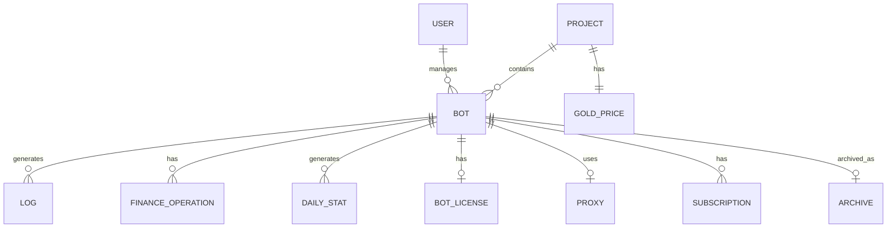

# Bot-Mox - Документация базы данных

> **Документация Firebase Realtime Database**  
> Версия схемы: 1.5.0 (Simplified License Structure)  
> Последнее обновление: 2026-02-01  
> Лимит трафика: 360 МБ/день

## Changelog

### v1.5.0 (2026-02-01) - Simplified License Structure
- **Упрощена структура** `bot_licenses`:
  - Удалено поле `bot_names` - имена ботов теперь берутся из `bots.character.name`
  - Удалены устаревшие поля `bot_id` и `botName`
- **Обновлен UI** страницы лицензий:
  - Удалена колонка "Bot Name" (дублировала информацию)
  - Упрощена колонка "Linked Bots" с кнопкой просмотра всех ботов
  - Упрощена форма добавления бота (убрано поле "Bot Name")
- **Миграция**: `scripts/migrate-licenses-v1.5.0.js`

### v1.3.0 (2026-01-31) - Reference Data Support
- **Добавлено**: Секция `referenceData` в `projects` для хранения справочников
  - `servers` - список игровых серверов
  - `races` - список рас с привязкой к фракциям и доступными классами
  - `classes` - список классов с ролями и типами ресурсов
  - `factions` - список фракций (Alliance, Horde)
- **Добавлено**: Поле `faction` в структуру `character` (bots и archive)
- **Данные**: Заполнены справочники для WoW Classic Anniversary EU TBC

### v1.2.0 (2026-01-31) - V6 Pixel Bridge Full Precision
- **Добавлено**: Секция `telemetry` в `bots` для real-time мониторинга
  - `smart_loot_session` - накопленная ценность лута (TSM + Vendor)
  - `deaths_session` - смертей за текущую сессию
  - `durability_avg` - средняя прочность экипировки
  - `bag_slots_free` - свободных слотов в сумках
  - `pixel_block_0_header` - RGB header для валидации (255,0,255)
  - `pixel_block_12_footer` - RGB footer для валидации (0,255,255)
  - `scan_status` - статус сканирования (valid/invalid/timeout)
- **Добавлено**: Поля валидации Pixel Bridge V6 в telemetry
- **Добавлено**: Коллекция `hourly_stats` для почасовой аналитики
- **Удалено**: Расчетные поля из `bots` (теперь вычисляются на клиенте):
  - `bots.*.farm.gold_per_hour`
  - `bots.*.leveling.xp_per_hour`
  - `bots.*.leveling.estimated_time_to_level`
- **Протокол**: Поддержка Pixel Bridge V6 (13 блоков, Full Precision, 1 раз/сек)

---

## Содержание

1. [Общая структура](#общая-структура)
2. [Сущности](#сущности)
3. [Связи между сущностями](#связи-между-сущностями)
4. [Примеры данных](#примеры-данных)
5. [Правила безопасности](#правила-безопасности)
6. [Оптимизация](#оптимизация)

---

## Общая структура

```
Firebase Realtime Database
├── projects/           # Игровые проекты
├── bots/               # Активные боты
│   └── telemetry/      # Real-time телеметрия (V5)
├── archive/            # Архив забаненных ботов
├── hourly_stats/       # Почасовая статистика (V5) [Retention: 14 дней]
├── daily_stats/        # Ежедневная статистика
├── logs/               # Логи событий
├── finance/            # Финансовые операции
│   ├── operations/     # Операции доход/расход
│   ├── daily_stats/    # Дневная агрегация
│   └── gold_price_history/  # История цен золота
├── notes/              # Заметки
├── gold_prices/        # Цены на золото
├── users/              # Пользователи системы
├── settings/           # Настройки системы
├── bot_licenses/       # Лицензии ботов
├── proxies/            # Прокси
├── subscriptions/      # Подписки
└── subscriptions_summary/  # Сводка подписок
```

---

## Сущности

### 1. Projects (Проекты)

**Путь**: `/projects/{project_id}`

**Описание**: Игровые проекты (WoW TBC, WoW Midnight).

**Структура**:
```typescript
interface Project {
  id: string;              // Уникальный ID (wow_tbc, wow_midnight)
  name: string;            // Отображаемое название
  game: string;            // Название игры
  expansion: string;       // Дополнение
  currency: string;        // Валюта игры (gold, silver)
  currency_symbol: string; // Символ валюты (g, s)
  max_level: number;       // Максимальный уровень
  professions: string[];   // Доступные профессии
  gold_price_usd: number;  // Цена 1000 золота в USD
  server_region: string;   // Регион серверов
  created_at: number;      // Timestamp создания
  updated_at: number;      // Timestamp обновления
  referenceData: {         // Справочники проекта
    servers: Record<string, GameServer>;
    races: Record<string, GameRace>;
    classes: Record<string, GameClass>;
    factions: Record<string, GameFaction>;
  };
}

// Справочник серверов
interface GameServer {
  id: string;              // ID сервера (lowercase)
  name: string;            // Отображаемое название
  region: string;          // Регион (EU, US)
  type: 'pve' | 'pvp' | 'rp' | 'rppvp';
}

// Справочник рас
interface GameRace {
  id: string;              // ID расы
  name: string;            // Название расы
  faction: 'alliance' | 'horde';
  available_classes: string[];  // Доступные классы для расы
}

// Справочник классов
interface GameClass {
  id: string;              // ID класса
  name: string;            // Название класса
  role: 'tank' | 'healer' | 'dps';
  resource: 'mana' | 'rage' | 'energy' | 'runic';
}

// Справочник фракций
interface GameFaction {
  id: 'alliance' | 'horde';
  name: string;            // Название фракции
  icon: string;            // Путь к иконке
}
```

**Пример**:
```json
{
  "wow_tbc": {
    "id": "wow_tbc",
    "name": "WoW TBC Classic",
    "game": "World of Warcraft",
    "expansion": "The Burning Crusade",
    "currency": "gold",
    "currency_symbol": "g",
    "max_level": 70,
    "professions": ["mining", "herbalism", "skinning", "enchanting", "engineering", "blacksmithing"],
    "gold_price_usd": 0.0125,
    "server_region": "Europe",
    "created_at": 1700000000000,
    "updated_at": 1700000000000,
    "referenceData": {
      "servers": {
        "firemaw": { "id": "firemaw", "name": "Firemaw", "region": "EU", "type": "pvp" },
        "gehennas": { "id": "gehennas", "name": "Gehennas", "region": "EU", "type": "pvp" },
        "golemagg": { "id": "golemagg", "name": "Golemagg", "region": "EU", "type": "pvp" },
        "hydraxian_waterlords": { "id": "hydraxian_waterlords", "name": "Hydraxian Waterlords", "region": "EU", "type": "pve" },
        "mirage_raceway": { "id": "mirage_raceway", "name": "Mirage Raceway", "region": "EU", "type": "pve" },
        "nethergarde_keep": { "id": "nethergarde_keep", "name": "Nethergarde Keep", "region": "EU", "type": "pve" },
        "pyrewood_village": { "id": "pyrewood_village", "name": "Pyrewood Village", "region": "EU", "type": "pve" },
        "razorfen": { "id": "razorfen", "name": "Razorfen", "region": "EU", "type": "pve" },
        "sulfuron": { "id": "sulfuron", "name": "Sulfuron", "region": "EU", "type": "pvp" },
        "auberdine": { "id": "auberdine", "name": "Auberdine", "region": "EU", "type": "pve" }
      },
      "races": {
        "orc": { "id": "orc", "name": "Orc", "faction": "horde", "available_classes": ["warrior", "hunter", "rogue", "shaman", "warlock"] },
        "troll": { "id": "troll", "name": "Troll", "faction": "horde", "available_classes": ["warrior", "hunter", "rogue", "shaman", "mage", "priest"] },
        "tauren": { "id": "tauren", "name": "Tauren", "faction": "horde", "available_classes": ["warrior", "hunter", "shaman", "druid"] },
        "undead": { "id": "undead", "name": "Undead", "faction": "horde", "available_classes": ["warrior", "rogue", "mage", "warlock", "priest"] },
        "blood_elf": { "id": "blood_elf", "name": "Blood Elf", "faction": "horde", "available_classes": ["paladin", "hunter", "rogue", "priest", "mage", "warlock"] },
        "human": { "id": "human", "name": "Human", "faction": "alliance", "available_classes": ["warrior", "paladin", "hunter", "rogue", "priest", "mage", "warlock"] },
        "dwarf": { "id": "dwarf", "name": "Dwarf", "faction": "alliance", "available_classes": ["warrior", "paladin", "hunter", "rogue", "priest"] },
        "gnome": { "id": "gnome", "name": "Gnome", "faction": "alliance", "available_classes": ["warrior", "rogue", "mage", "warlock"] },
        "night_elf": { "id": "night_elf", "name": "Night Elf", "faction": "alliance", "available_classes": ["warrior", "hunter", "rogue", "priest", "mage", "druid"] },
        "draenei": { "id": "draenei", "name": "Draenei", "faction": "alliance", "available_classes": ["warrior", "paladin", "hunter", "priest", "mage", "shaman"] }
      },
      "classes": {
        "warrior": { "id": "warrior", "name": "Warrior", "role": "tank", "resource": "rage" },
        "paladin": { "id": "paladin", "name": "Paladin", "role": "healer", "resource": "mana" },
        "hunter": { "id": "hunter", "name": "Hunter", "role": "dps", "resource": "mana" },
        "rogue": { "id": "rogue", "name": "Rogue", "role": "dps", "resource": "energy" },
        "priest": { "id": "priest", "name": "Priest", "role": "healer", "resource": "mana" },
        "shaman": { "id": "shaman", "name": "Shaman", "role": "healer", "resource": "mana" },
        "mage": { "id": "mage", "name": "Mage", "role": "dps", "resource": "mana" },
        "warlock": { "id": "warlock", "name": "Warlock", "role": "dps", "resource": "mana" },
        "druid": { "id": "druid", "name": "Druid", "role": "healer", "resource": "mana" }
      },
      "factions": {
        "alliance": { "id": "alliance", "name": "Alliance", "icon": "/icons/factions/alliance.png" },
        "horde": { "id": "horde", "name": "Horde", "icon": "/icons/factions/horde.png" }
      }
    }
  }
}
```

**Справочники WoW Classic Anniversary EU TBC:**

| Тип | Количество | Описание |
|-----|------------|----------|
| Серверы | 10 | Firemaw, Gehennas, Golemagg, Hydraxian Waterlords, Mirage Raceway, Nethergarde Keep, Pyrewood Village, Razorfen, Sulfuron, Auberdine |
| Расы | 10 | 5 Horde (Orc, Troll, Tauren, Undead, Blood Elf) + 5 Alliance (Human, Dwarf, Gnome, Night Elf, Draenei) |
| Классы | 9 | Warrior, Paladin, Hunter, Rogue, Priest, Shaman, Mage, Warlock, Druid |

---

### 2. Bots (Активные боты)

**Путь**: `/bots/{bot_id}`

**Описание**: Основная сущность системы - активные боты.

**Структура**:
```typescript
interface Bot {
  id: string;                    // UUID v4
  project_id: string;            // Ссылка на проект
  status: BotStatus;             // Статус бота
  
  // VM информация
  vm: {
    name: string;                // Имя VM (например, WoW7)
    ip: string;                  // IP адрес VM
    created_at: string;          // ISO дата создания
  };
  
  // Персонаж
  character: {
    name: string;                // Имя персонажа
    level: number;               // Текущий уровень
    race: string;                // Раса (ID из referenceData.races)
    class: string;               // Класс (ID из referenceData.classes)
    server: string;              // Сервер (ID из referenceData.servers)
    faction: 'alliance' | 'horde';  // Фракция (ID из referenceData.factions)
  };
  
  // Аккаунт
  account: {
    email: string;               // Email аккаунта
    password: string;            // Пароль
    mail_provider: string;       // Провайдер почты
    bnet_created_at: number;     // Timestamp регистрации BNet
    mail_created_at: number;     // Timestamp регистрации почты
  };
  
  // Персона (фейковые данные)
  person: {
    first_name: string;
    last_name: string;
    birth_date: string;          // DD-MM-YYYY
    country: string;
    city: string;
    address: string;
    zip: string;
  };
  
  // Прокси
  proxy: {
    full_string: string;         // ip:port:login:password
    type: 'none' | 'http' | 'socks5';
    ip: string;
    port: number;
    login: string;
    password: string;
    provider: string;
    country: string;
    fraud_score: number;         // 0-100
    VPN: boolean;
    Proxy: boolean;
    detect_country: boolean;
    created_at: number;
    expires_at: number;
  };
  
  // Прокачка
  leveling: {
    current_level: number;
    target_level: number;
    xp_current: number;
    xp_required: number;
    location: string;
    sub_location: string;
    started_at: number;
    finished_at: number;
  };
  
  // Профессии
  professions: {
    [profession_name: string]: {
      name: string;
      skill_points: number;
      max_skill_points: number;
      started_at: number;
      finished_at: number;
    }
  };
  
  // Расписание
  schedule: {
    [day: string]: ScheduleSlot[];  // 0=Sun, 1=Mon, ..., 6=Sat
  };
  
  // Фарм
  farm: {
    total_gold: number;
    session_start: number;
    location: string;
    profile: string;
    all_farmed_gold: number;
  };
  
  // Телеметрия (V6 Pixel Bridge Full Precision)
  telemetry: {
    smart_loot_session: number;    // Накопленная ценность лута (TSM + Vendor)
    deaths_session: number;        // Смертей за сессию
    durability_avg: number;        // Средняя прочность (0-100)
    bag_slots_free: number;        // Свободных слотов в сумках
    last_sync_ts: number;          // Timestamp последней синхронизации
    pixel_block_0_header: string;  // RGB header (должен быть 255,0,255)
    pixel_block_12_footer: string; // RGB footer (должен быть 0,255,255)
    scan_status: 'valid' | 'invalid' | 'timeout'; // Статус сканирования
  };
  
  // Финансы
  finance: {
    total_farmed_usd: number;
    total_expenses_usd: number;
    roi_percent: number;
  };
  
  // Мониторинг
  monitor: {
    screenshot_request: boolean;
    screenshot_url: string | null;
    screenshot_timestamp: number | null;
    status: 'idle' | 'requested' | 'uploading' | 'error';
  };
  
  last_seen: number;             // Timestamp последней активности
  updated_at: number;            // Timestamp обновления
  created_at: number;            // Timestamp создания
}

type BotStatus = 'offline' | 'prepare' | 'leveling' | 'profession' | 'farming' | 'banned';

interface ScheduleSlot {
  start: string;      // HH:MM
  end: string;        // HH:MM
  enabled: boolean;
  profile: string;
}
```

**Статусы ботов**:

| Статус | Описание | Цвет |
|--------|----------|------|
| `offline` | Бот неактивен | Серый |
| `prepare` | Подготовка | Синий |
| `leveling` | Прокачка уровня | Фиолетовый |
| `profession` | Прокачка профессии | Розовый |
| `farming` | Фарм | Зелёный |
| `banned` | Забанен | Красный |

**Определение offline**: Бот считается offline, если `(Date.now() - last_seen) > 300000` (5 минут).

---

### 3. Archive (Архив)

**Путь**: `/archive/{archive_id}`

**Описание**: Архив забаненных или удалённых ботов.

**Структура**:
```typescript
interface ArchiveEntry {
  bot_id: string;                // ID бота до архивации
  archived_at: number;           // Timestamp архивации
  reason: 'banned' | 'manual_stop' | 'error' | 'migrated';
  
  ban_details: {
    date: number;                // Timestamp бана
    reason: string;              // Причина бана
    ban_mechanism: string;       // Механизм бана
  };
  
  snapshot: {
    project_id: string;
    character: {
      name: string;
      level: number;
      race: string;
      class: string;
      server: string;
      faction: string;
    };
    final_level: number;
    total_farmed: number;
    total_earned_gold: number;
    total_runtime_hours: number;
  };
}
```

---

### 4. Hourly Stats (Почасовая статистика) [V5]

**Путь**: `/hourly_stats/{project_id}/{date}/{bot_id}/{hour}`

**Описание**: Детальная почасовая статистика для построения графиков с зумом внутри дня.

**Структура**:
```typescript
interface HourlyStats {
  xp_gained: number;             // XP полученный за этот час
  gold_farmed: number;           // Чистое золото (loot)
  smart_loot_value: number;      // Оценочная стоимость (TSM + Vendor)
  deaths: number;                // Количество смертей
  online_minutes: number;        // Минут в онлайне (макс 60)
}
```

**Примечания**:
- **Retention**: 14 дней (для горячей аналитики)
- Сканнер записывает данные раз в час
- При сбросе сессии (ReloadUI) сканнер корректно обрабатывает дельты
- Формат часа: `00-23`

**Пример**:
```json
{
  "wow_tbc": {
    "2026-01-29": {
      "550e8400-e29b-41d4-a716-446655440001": {
        "14": {
          "xp_gained": 45000,
          "gold_farmed": 120,
          "smart_loot_value": 1250,
          "deaths": 0,
          "online_minutes": 60
        },
        "15": {
          "xp_gained": 20000,
          "gold_farmed": 45,
          "smart_loot_value": 500,
          "deaths": 2,
          "online_minutes": 45
        }
      }
    }
  }
}
```

---

### 5. Daily Stats (Ежедневная статистика)

**Путь**: `/daily_stats/{project_id}/{date}/{bot_id}`

**Описание**: Агрегированная статистика по ботам за день.

**Структура**:
```typescript
interface DailyStats {
  gold_farmed: number;           // Золота зафармлено
  hours_online: number;          // Часов онлайн
  xp_gained: number;             // XP получено
  deaths: number;                // Количество смертей
  levels_gained: number;         // Уровней получено
  last_update: number;           // Timestamp последнего обновления
}
```

**Примечания**:
- Скрипт обновляет инкрементально (добавляет разницу)
- При отключении света прогресс не теряется
- Формат даты: `YYYY-MM-DD`

---

### 6. Logs (Логи)

**Путь**: `/logs/{bot_id}/{event_id}`

**Описание**: Только важные события (бан, левел-ап, смерть).

**Структура**:
```typescript
interface LogEntry {
  type: 'ban' | 'level_up' | 'death' | 'status_change';
  timestamp: number;
  message: string;
  data: {
    // Дополнительные данные по типу события
    [key: string]: any;
  };
}
```

**Типы событий**:

| Тип | Описание | Данные |
|-----|----------|--------|
| `ban` | Бан аккаунта | `reason`, `date` |
| `level_up` | Повышение уровня | `old_level`, `new_level`, `location` |
| `death` | Смерть персонажа | `location`, `killer` |
| `status_change` | Смена статуса | `old_status`, `new_status` |

**Оптимизация**:
- Логи хранятся по `bot_id` для избежания больших списков
- Автоматическая очистка логов старше `logs_retention_days`

---

### 7. Finance (Финансы)

**Путь**: `/finance/`

**Структура**:
```typescript
interface Finance {
  operations: {
    [operation_id: string]: {
      type: 'income' | 'expense';
      category: 'subscription game' | 'subscription bot' | 'proxy' | 'sale' | 'other';
      bot_id: string | null;       // null для глобальных операций
      description: string;
      amount: number;
      currency: 'USD' | 'gold';
      gold_price_at_time: number | null;
      date: number;
      created_at: number;
    }
  };
  
  daily_stats: {
    [date: string]: {
      date: string;                // YYYY-MM-DD
      total_expenses: number;
      total_revenue: number;
      net_profit: number;
      active_bots: number;
      total_farmed: {
        [project_id: string]: {
          gold: number;
        }
      }
    }
  };
  
  gold_price_history: {
    [date: string]: {
      price: number;               // Цена за 1000 золота
    }
  };
}
```

---

### 8. Notes (Заметки)

**Путь**: `/notes/{note_id}`

**Описание**: Заметки с чекбоксами для гайдов и напоминаний.

**Структура**:
```typescript
interface Note {
  text: string;
  completed: boolean;
  bot_id: string | null;         // null = глобальная заметка
  created_at: number;
  updated_at: number;
}
```

---

### 9. Gold Prices (Цены на золото)

**Путь**: `/gold_prices/{project_id}`

**Структура**:
```typescript
interface GoldPrice {
  current: {
    price_per_1000: number;
    updated_at: number;
    updated_by: string;
    source: 'manual' | 'api';
  };
  history: {
    [timestamp: string]: {
      price_per_1000: number;
      date: number;
    }
  }
}
```

---

### 10. Users (Пользователи)

**Путь**: `/users/{user_id}`

**Структура**:
```typescript
interface User {
  id: string;
  email: string;
  name: string;
  role: 'admin' | 'operator' | 'viewer';
  permissions: {
    bots: ('read' | 'write' | 'delete')[];
    finance: ('read' | 'write')[];
    settings: ('read' | 'write')[];
    archive: ('read' | 'write')[];
  };
  telegram_id: string | null;
  notifications: {
    bot_start: boolean;
    bot_status_change: boolean;
    bot_offline: boolean;
    bot_banned: boolean;
    daily_report: boolean;
    low_roi_alert: boolean;
  };
  last_login: number;
  created_at: number;
}
```

---

### 11. Settings (Настройки)

**Путь**: `/settings/`

**Структура**:
```typescript
interface Settings {
  system: {
    app_name: string;
    theme: 'dark' | 'light';
    currency: 'USD' | 'EUR';
  };
  
  offline_detection: {
    offline_timeout_sec: number;   // По умолчанию 300 (5 минут)
  };
  
  data_retention: {
    logs_retention_days: number;   // По умолчанию 7
  };
  
  notifications: {
    telegram_bot_token: string;
    telegram_chat_id: string;
    alerts: {
      bot_offline_delay_minutes: number;
      low_roi_threshold: number;
      daily_report_time: string;   // HH:MM
    }
  };
  
  roi_calculation: {
    include_proxy_cost: boolean;
    include_subscription_cost: boolean;
    include_session_cost: boolean;
    depreciation_days: number;
  };
  
  data_export: {
    auto_archive_daily: boolean;
    local_storage_key: string;
  };
  
  development: {
    show_example_data: boolean;
    use_mock_data: boolean;
  }
}
```

---

### 12. Bot Licenses (Лицензии)

**Путь**: `/bot_licenses/{license_id}`

**Структура** (v1.5.0 - упрощенная структура):
```typescript
interface BotLicense {
  id: string;
  key: string;                   // SIN-XXXX-XXXX-XXXX
  type: 'sin' | 'other';
  status: 'active' | 'expired' | 'revoked';
  bot_ids: string[];             // Массив ID ботов
  expires_at: number;
  created_at: number;
  updated_at: number;
}
```

**Примечания**:
- v1.5.0: Упрощена структура - удалено поле `bot_names`. Имена ботов теперь берутся из `bots.character.name`
- v1.4.0: Поле `bot_id` (string | null) заменено на `bot_ids` (string[]) для поддержки SIN-лицензий с несколькими ботами
- Для миграции с v1.4.0 на v1.5.0 используйте `scripts/migrate-licenses-v1.5.0.js`
- Для миграции со старых версий на v1.4.0 используйте `scripts/migrate-licenses-v1.4.0.js`

---

### 13. Proxies (Прокси)

**Путь**: `/proxies/{proxy_id}`

**Структура**:
```typescript
interface Proxy {
  id: string;
  ip: string;
  port: number;
  login: string;
  password: string;
  provider: string;
  country: string;
  type: 'http' | 'socks5';
  status: 'active' | 'expired' | 'banned';
  bot_id: string | null;
  fraud_score: number;
  expires_at: number;
  created_at: number;
  updated_at: number;
}
```

---

### 14. Subscriptions (Подписки)

**Путь**: `/subscriptions/{subscription_id}`

**Структура**:
```typescript
interface Subscription {
  id: string;
  bot_id: string;
  type: string;                  // wow_tbc, wow_midnight, etc.
  status: 'active' | 'expired' | 'cancelled';
  expires_at: number;
  auto_renew: boolean;
  created_at: number;
  updated_at: number;
}
```

---

### 15. Subscriptions Summary (Сводка подписок)

**Путь**: `/subscriptions_summary/`

**Структура**:
```typescript
interface SubscriptionSummary {
  total_active: number;
  total_expired: number;
  by_type: {
    [type: string]: {
      active_count: number;
      expired_count: number;
      total_count: number;
    }
  };
  expiring_soon: {
    [subscription_id: string]: {
      id: string;
      bot_id: string;
      type: string;
      expires_at: number;
      days_remaining: number;
    }
  };
  last_updated: number;
}
```

---

## Связи между сущностями



### Типы связей

| Родитель | Ребёнок | Тип | Описание |
|----------|---------|-----|----------|
| Project | Bot | 1:N | Один проект содержит много ботов |
| Bot | Log | 1:N | Один бот генерирует много логов |
| Bot | Finance Operation | 1:N | Один бот имеет много операций |
| Bot | Daily Stat | 1:N | Один бот имеет статистику за множество дней |
| Bot | Bot License | 1:0..1 | Один бот имеет 0 или 1 лицензию |
| Bot | Proxy | 1:0..1 | Один бот использует 0 или 1 прокси |
| Bot | Subscription | 1:N | Один бот имеет много подписок |
| Bot | Archive | 1:0..1 | Один бот может быть архивирован |
| Project | Gold Price | 1:1 | Один проект имеет одну цену золота |
| User | Bot | N:M | Пользователи управляют ботами |

---

## Примеры данных

### Создание нового бота

```json
{
  "bots": {
    "550e8400-e29b-41d4-a716-446655440001": {
      "id": "550e8400-e29b-41d4-a716-446655440001",
      "project_id": "wow_tbc",
      "status": "farming",
      "vm": {
        "name": "WoW7",
        "ip": "192.168.116.22",
        "created_at": "2026-01-29T03:32:00Z"
      },
      "character": {
        "name": "FarmBot01",
        "level": 68,
        "race": "orc",
        "class": "warrior",
        "server": "gehennas",
        "faction": "horde"
      },
      "account": {
        "email": "wowbot101@example.com",
        "password": "secure_pass_123",
        "mail_provider": "gmail",
        "bnet_created_at": 1704067200000,
        "mail_created_at": 1703980800000
      },
      "person": {
        "first_name": "John",
        "last_name": "Smith",
        "birth_date": "15-05-1990",
        "country": "Turkey",
        "city": "Istanbul",
        "address": "123 Main Street",
        "zip": "34000"
      },
      "proxy": {
        "full_string": "192.168.1.100:8080:user1:pass1",
        "type": "socks5",
        "ip": "192.168.1.100",
        "port": 8080,
        "login": "user1",
        "password": "pass1",
        "provider": "smartproxy",
        "country": "TR",
        "fraud_score": 15,
        "VPN": false,
        "Proxy": true,
        "detect_country": true,
        "created_at": 1704067200000,
        "expires_at": 1735689600000
      },
      "leveling": {
        "current_level": 68,
        "target_level": 70,
        "xp_current": 1250000,
        "xp_required": 1500000,
        "xp_per_hour": 8500,
        "estimated_time_to_level": 6.5,
        "location": "Nagrand",
        "sub_location": "Laughing Skull Ruins",
        "started_at": 1706486400000,
        "finished_at": 0
      },
      "professions": {
        "mining": {
          "name": "Mining",
          "skill_points": 350,
          "max_skill_points": 375,
          "started_at": 1706400000000,
          "finished_at": 0
        }
      },
      "schedule": {
        "1": [{"start": "09:00", "end": "17:00", "enabled": true, "profile": "farming"}]
      },
      "farm": {
        "total_gold": 15420,
        "gold_per_hour": 125.5,
        "session_start": 1706659200000,
        "location": "Shadowmoon Valley",
        "profile": "mining_herbs",
        "all_farmed_gold": 25800
      },
      "finance": {
        "total_farmed_usd": 192.75,
        "total_expenses_usd": 45.00,
        "roi_percent": 428.33
      },
      "monitor": {
        "screenshot_request": false,
        "screenshot_url": null,
        "screenshot_timestamp": null,
        "status": "idle"
      },
      "last_seen": 1706572800000,
      "updated_at": 1706572800000,
      "created_at": 1704067200000
    }
  }
}
```

---

## Правила безопасности

```json
{
  "rules": {
    ".read": "auth != null",
    ".write": "auth != null && auth.token.admin === true",
    
    "projects": {
      ".read": "auth != null",
      ".write": "auth != null && auth.token.admin === true"
    },
    
    "bots": {
      ".read": "auth != null",
      ".write": "auth != null && auth.token.admin === true",
      "$bot_id": {
        ".validate": "newData.hasChildren(['id', 'project_id', 'status', 'character'])"
      }
    },
    
    "archive": {
      ".read": "auth != null",
      ".write": "auth != null && auth.token.admin === true"
    },
    
    "logs": {
      ".read": "auth != null",
      ".write": "auth != null"
    },
    
    "finance": {
      ".read": "auth != null",
      ".write": "auth != null && auth.token.admin === true",
      "operations": {
        "$op_id": {
          ".validate": "newData.hasChildren(['type', 'category', 'amount', 'currency', 'date'])"
        }
      }
    },
    
    "notes": {
      ".read": "auth != null",
      ".write": "auth != null"
    },
    
    "gold_prices": {
      ".read": "auth != null",
      ".write": "auth != null && auth.token.admin === true"
    },
    
    "users": {
      ".read": "auth != null && auth.token.admin === true",
      ".write": "auth != null && auth.token.admin === true",
      "$user_id": {
        ".read": "auth != null && (auth.token.admin === true || auth.uid === $user_id)"
      }
    },
    
    "settings": {
      ".read": "auth != null",
      ".write": "auth != null && auth.token.admin === true"
    },
    
    "bot_licenses": {
      ".read": "auth != null",
      ".write": "auth != null && auth.token.admin === true"
    },
    
    "proxies": {
      ".read": "auth != null",
      ".write": "auth != null && auth.token.admin === true"
    },
    
    "subscriptions": {
      ".read": "auth != null",
      ".write": "auth != null && auth.token.admin === true"
    },
    
    "subscriptions_summary": {
      ".read": "auth != null",
      ".write": "auth != null && auth.token.admin === true"
    }
  }
}
```

---

## Оптимизация

### Рекомендации по оптимизации трафика (360 МБ/день)

1. **Используйте shallow queries**
   - Запрашивайте только нужные узлы
   - Избегайте загрузки всей БД

2. **Лимит глубины логов**
   - Храните не более 100 последних событий на бота
   - Архивируйте старые

3. **Батчевые обновления**
   - Объединяйте несколько изменений в один `update()` вызов

4. **Отключите offline persistence для редких данных**
   - Для статических данных (projects, settings) не нужна синхронизация

5. **Используйте onDisconnect**
   - Автоматически обновляйте статус при отключении

6. **Пагинация для списков**
   - Загружайте ботов пачками по 10-20 штук

7. **Сжатие данных**
   - Используйте короткие ключи (`st` вместо `status`)
   - Числа вместо строк где возможно

8. **Кэширование на клиенте**
   - Не перезагружайте статические данные (projects, settings)

9. **Агрегация статистики**
   - Используйте `daily_stats` для графиков вместо логов

10. **Локальное хранение архивов**
    - Сохраняйте скачанные данные в localStorage

---

## Индексы и производительность

### Рекомендуемые индексы

Firebase RTDB не требует явного создания индексов, но для оптимизации запросов:

- Сортировка по `last_seen` для определения offline статуса
- Сортировка по `created_at` для списков
- Фильтрация по `status` для группировки

### Лимиты

| Параметр | Лимит |
|----------|-------|
| Размер одной записи | ~10 MB |
| Глубина вложенности | 32 уровня |
| Ключ | UTF-8, до 768 байт |
| Трафик (Spark план) | 360 МБ/день |
| Одновременные соединения | 100,000 |

---

**Для будущих агентов**:  
Подробная схема также доступна в [`DATABASE_SCHEMA.json`](DATABASE_SCHEMA.json).  
Примеры данных для импорта в [`EXAMPLE_DATA.json`](EXAMPLE_DATA.json).
