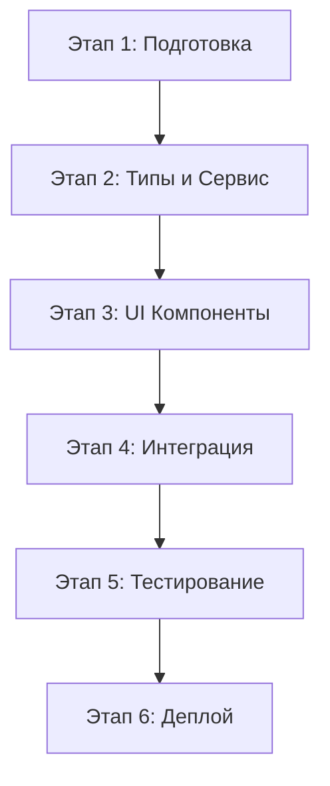
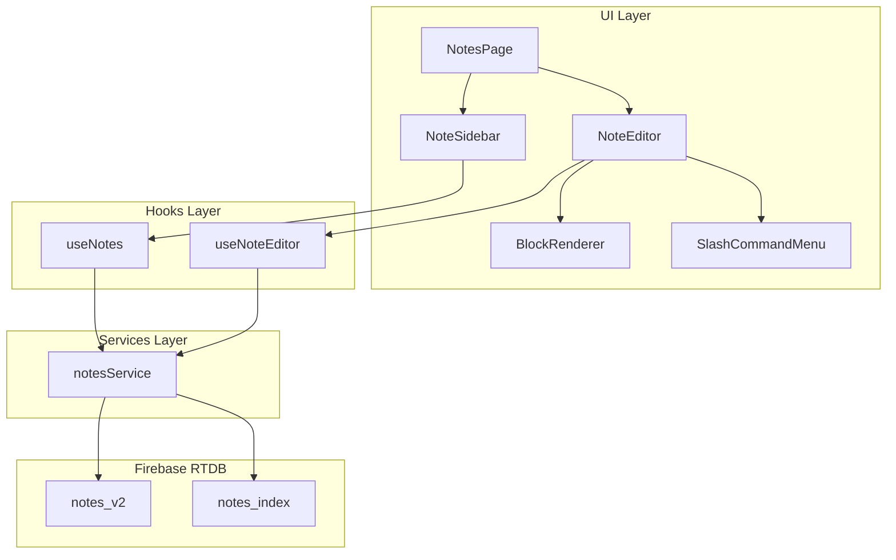

# Архитектура системы заметок с Rich Content (Bot-Mox)

## Сводка анализа текущей реализации

### Текущая схема в DATABASE_SCHEMA.json (строки 813-847)
```json
"notes": {
  "_description": "Заметки с чекбоксами, для гайдов и напоминалок",
  "_schema": {
    "$note_id": {
      "text": "string - текст заметки",
      "completed": "boolean - выполнена ли",
      "bot_id": "string | null - привязка к боту (null = глобальная)",
      "created_at": "number - timestamp создания",
      "updated_at": "number - timestamp обновления"
    }
  }
}
```

### Текущий тип Note (bot-mox/src/types/index.ts, строки 192-198)
```typescript
export interface Note {
  id: string;
  text: string;
  completed: boolean;
  created_at: number;
}
```

### Текущая реализация NotesPage
- Простой список заметок с чекбоксами
- Только текстовое поле (однострочное)
- Локальное состояние с mock данными
- Нет интеграции с Firebase

---

## 1. Новая схема данных для Rich Content Notes

### 1.1 Структура блоков

```typescript
// Типы блоков поддерживаемые редактором
type NoteBlockType = 
  | 'heading_1'      // H1 заголовок
  | 'heading_2'      // H2 заголовок  
  | 'heading_3'      // H3 заголовок
  | 'paragraph'      // Обычный текст
  | 'checkbox'       // Чекбокс с текстом
  | 'bullet_list'    // Маркированный список
  | 'numbered_list'; // Нумерованный список

// Базовый интерфейс для всех блоков
interface NoteBlockBase {
  id: string;           // Уникальный ID блока (uuid)
  type: NoteBlockType;
  created_at: number;
  updated_at: number;
}

// Текстовый блок (heading, paragraph)
interface TextBlock extends NoteBlockBase {
  type: 'heading_1' | 'heading_2' | 'heading_3' | 'paragraph';
  content: string;
}

// Чекбокс блок
interface CheckboxBlock extends NoteBlockBase {
  type: 'checkbox';
  content: string;
  checked: boolean;
}

// Элемент списка
interface ListItem {
  id: string;
  content: string;
  checked?: boolean;    // Для чекбокс-списков (опционально)
}

// Список (маркированный или нумерованный)
interface ListBlock extends NoteBlockBase {
  type: 'bullet_list' | 'numbered_list';
  items: ListItem[];
}

// Объединенный тип блока
export type NoteBlock = TextBlock | CheckboxBlock | ListBlock;
```

### 1.2 Структура заметки

```typescript
interface Note {
  id: string;
  title: string;              // Заголовок заметки (для списка)
  blocks: NoteBlock[];        // Массив блоков контента
  tags: string[];             // Теги для поиска
  bot_id: string | null;      // Привязка к боту (null = глобальная)
  project_id: string | null;  // Привязка к проекту
  is_pinned: boolean;         // Закреплена ли
  created_at: number;
  updated_at: number;
  created_by: string;         // ID пользователя
}
```

### 1.3 Firebase Realtime Database Schema

```json
{
  "notes_v2": {
    "_description": "Заметки с rich content (блочная структура)",
    "_schema": {
      "$note_id": {
        "id": "string - уникальный ID заметки",
        "title": "string - заголовок заметки",
        "blocks": {
          "$block_id": {
            "id": "string - ID блока",
            "type": "string - heading_1|heading_2|heading_3|paragraph|checkbox|bullet_list|numbered_list",
            "content": "string - текст (для text/checkbox)",
            "checked": "boolean - для checkbox",
            "items": "array - для списков [{id, content, checked?}]"
          }
        },
        "tags": "array<string> - теги",
        "bot_id": "string|null - привязка к боту",
        "project_id": "string|null - привязка к проекту",
        "is_pinned": "boolean - закреплена",
        "created_at": "number - timestamp",
        "updated_at": "number - timestamp",
        "created_by": "string - ID пользователя"
      }
    },
    "_example": {
      "note_001": {
        "id": "note_001",
        "title": "Гайд по фарму золота",
        "blocks": {
          "block_001": {
            "id": "block_001",
            "type": "heading_1",
            "content": "Фарм в Shadowmoon Valley"
          },
          "block_002": {
            "id": "block_002",
            "type": "paragraph",
            "content": "Лучшие локации для фарма в TBC Classic"
          },
          "block_003": {
            "id": "block_003",
            "type": "checkbox",
            "content": "Проверить цены на аукционе",
            "checked": false
          },
          "block_004": {
            "id": "block_004",
            "type": "bullet_list",
            "items": [
              {"id": "item_1", "content": "Elemental Plateau"},
              {"id": "item_2", "content": "Netherwing Ledge"}
            ]
          }
        },
        "tags": ["farm", "gold", "tbc"],
        "bot_id": null,
        "project_id": "wow_tbc",
        "is_pinned": true,
        "created_at": 1706572800000,
        "updated_at": 1706572800000,
        "created_by": "admin_001"
      }
    }
  },
  
  "notes_index": {
    "_description": "Индекс для быстрого поиска и списка заметок",
    "_schema": {
      "$note_id": {
        "id": "string",
        "title": "string",
        "preview": "string - первые 100 символов",
        "tags": "array<string>",
        "bot_id": "string|null",
        "project_id": "string|null",
        "is_pinned": "boolean",
        "updated_at": "number"
      }
    }
  }
}
```

---

## 2. TypeScript типы

```typescript
// ============================================
// Note Block Types
// ============================================

export type NoteBlockType = 
  | 'heading_1' 
  | 'heading_2' 
  | 'heading_3' 
  | 'paragraph' 
  | 'checkbox' 
  | 'bullet_list' 
  | 'numbered_list';

export interface NoteBlockBase {
  id: string;
  type: NoteBlockType;
  created_at: number;
  updated_at: number;
}

export interface TextBlock extends NoteBlockBase {
  type: 'heading_1' | 'heading_2' | 'heading_3' | 'paragraph';
  content: string;
}

export interface CheckboxBlock extends NoteBlockBase {
  type: 'checkbox';
  content: string;
  checked: boolean;
}

export interface ListItem {
  id: string;
  content: string;
  checked?: boolean;
}

export interface ListBlock extends NoteBlockBase {
  type: 'bullet_list' | 'numbered_list';
  items: ListItem[];
}

export type NoteBlock = TextBlock | CheckboxBlock | ListBlock;

// ============================================
// Note Types
// ============================================

export interface Note {
  id: string;
  title: string;
  blocks: NoteBlock[];
  tags: string[];
  bot_id: string | null;
  project_id: string | null;
  is_pinned: boolean;
  created_at: number;
  updated_at: number;
  created_by: string;
}

// Для Firebase (блоки как объект с ключами)
export interface NoteDb {
  id: string;
  title: string;
  blocks: Record<string, NoteBlock>;
  tags: string[];
  bot_id: string | null;
  project_id: string | null;
  is_pinned: boolean;
  created_at: number;
  updated_at: number;
  created_by: string;
}

// Упрощенная версия для списка (индекс)
export interface NoteIndex {
  id: string;
  title: string;
  preview: string;
  tags: string[];
  bot_id: string | null;
  project_id: string | null;
  is_pinned: boolean;
  updated_at: number;
}

// ============================================
// Editor Types
// ============================================

export interface BlockEditorProps {
  block: NoteBlock;
  isFocused: boolean;
  onChange: (block: NoteBlock) => void;
  onFocus: () => void;
  onBlur: () => void;
  onKeyDown: (e: React.KeyboardEvent) => void;
  onSplit: (content: string, type: NoteBlockType) => void;
  onMerge: () => void;
  onConvert: (type: NoteBlockType) => void;
}

export interface NoteEditorState {
  note: Note | null;
  selectedBlockId: string | null;
  isSaving: boolean;
  lastSaved: number | null;
  hasUnsavedChanges: boolean;
}

// ============================================
// Service Types
// ============================================

export interface NotesFilter {
  search?: string;
  tags?: string[];
  bot_id?: string | null;
  project_id?: string | null;
  is_pinned?: boolean;
}

export interface NotesSort {
  field: 'updated_at' | 'created_at' | 'title';
  direction: 'asc' | 'desc';
}

export interface CreateNoteData {
  title: string;
  bot_id?: string | null;
  project_id?: string | null;
  tags?: string[];
}

export interface UpdateNoteData {
  title?: string;
  blocks?: NoteBlock[];
  tags?: string[];
  is_pinned?: boolean;
}
```

---

## 3. Подход для Rich Text Editor

### 3.1 Выбранный подход: Кастомный Block-based Editor

**Обоснование:**
- Slate.js тяжелый (~100KB+) и избыточен для наших нужд
- contenteditable сложен в управлении и кросс-браузерной совместимости
- Кастомный подход дает полный контроль и соответствует стеку (React + Ant Design)
- Структура "блоков" идеально ложится на Firebase Realtime Database

### 3.2 Архитектура редактора

```
┌─────────────────────────────────────────────────────────────┐
│                    NoteEditor (Container)                   │
├─────────────────────────────────────────────────────────────┤
│  ┌─────────────────────────────────────────────────────┐   │
│  │              BlockList (Manager)                    │   │
│  │  ┌─────────────────────────────────────────────┐   │   │
│  │  │  BlockRenderer (Switch by block.type)       │   │   │
│  │  │  ┌─────────────────────────────────────┐   │   │   │
│  │  │  │  TextBlockComponent                 │   │   │   │
│  │  │  │  - H1, H2, H3, Paragraph            │   │   │   │
│  │  │  │  - contentEditable div              │   │   │   │
│  │  │  └─────────────────────────────────────┘   │   │   │
│  │  │  ┌─────────────────────────────────────┐   │   │   │
│  │  │  │  CheckboxBlockComponent             │   │   │   │
│  │  │  │  - Ant Design Checkbox + Input      │   │   │   │
│  │  │  └─────────────────────────────────────┘   │   │   │
│  │  │  ┌─────────────────────────────────────┐   │   │   │
│  │  │  │  ListBlockComponent                 │   │   │   │
│  │  │  │  - Bullet or Numbered list          │   │   │   │
│  │  │  │  - Nested items support             │   │   │   │
│  │  │  └─────────────────────────────────────┘   │   │   │
│  │  └─────────────────────────────────────────────┘   │   │
│  └─────────────────────────────────────────────────────┘   │
│  ┌─────────────────────────────────────────────────────┐   │
│  │  SlashCommandMenu (/) - выбор типа блока            │   │
│  └─────────────────────────────────────────────────────┘   │
└─────────────────────────────────────────────────────────────┘
```

### 3.3 Клавиатурная навигация

| Клавиша | Действие |
|---------|----------|
| `Enter` | Создать новый блок paragraph ниже |
| `Enter` (в списке) | Создать новый item или выйти из списка |
| `Backspace` (пустой блок) | Удалить блок и перейти к предыдущему |
| `Backspace` (в начале) | Merge с предыдущим блоком |
| `/` | Открыть slash-меню выбора типа |
| `↑/↓` | Навигация между блоками |
| `Cmd/Ctrl + Shift + 1/2/3` | Конвертировать в H1/H2/H3 |
| `Cmd/Ctrl + Shift + 7` | Конвертировать в numbered list |
| `Cmd/Ctrl + Shift + 8` | Конвертировать в bullet list |
| `Cmd/Ctrl + Shift + 9` | Конвертировать в checkbox |

### 3.4 Slash Commands

```typescript
const SLASH_COMMANDS = [
  { id: 'h1', label: 'Heading 1', icon: 'H1', type: 'heading_1' },
  { id: 'h2', label: 'Heading 2', icon: 'H2', type: 'heading_2' },
  { id: 'h3', label: 'Heading 3', icon: 'H3', type: 'heading_3' },
  { id: 'text', label: 'Text', icon: 'Text', type: 'paragraph' },
  { id: 'checkbox', label: 'Checkbox', icon: 'CheckSquare', type: 'checkbox' },
  { id: 'bullet', label: 'Bullet List', icon: 'List', type: 'bullet_list' },
  { id: 'numbered', label: 'Numbered List', icon: 'ListOrdered', type: 'numbered_list' },
];
```

---

## 4. Сервис для работы с заметками

```typescript
// bot-mox/src/services/notesService.ts

import { ref, set, get, push, update, remove, query, orderByChild } from 'firebase/database';
import { db } from '../utils/firebase';
import type { 
  Note, NoteDb, NoteIndex, NoteBlock, 
  CreateNoteData, UpdateNoteData, NotesFilter, NotesSort 
} from '../types';

const NOTES_PATH = 'notes_v2';
const NOTES_INDEX_PATH = 'notes_index';

export const notesService = {
  // ==========================================
  // CRUD Operations
  // ==========================================
  
  async createNote(data: CreateNoteData, userId: string): Promise<Note> {
    const noteId = push(ref(db, NOTES_PATH)).key!;
    const now = Date.now();
    
    const noteDb: NoteDb = {
      id: noteId,
      title: data.title,
      blocks: {},
      tags: data.tags || [],
      bot_id: data.bot_id ?? null,
      project_id: data.project_id ?? null,
      is_pinned: false,
      created_at: now,
      updated_at: now,
      created_by: userId,
    };
    
    await set(ref(db, `${NOTES_PATH}/${noteId}`), noteDb);
    await updateNoteIndex(noteId, noteDb);
    
    return convertDbToNote(noteDb);
  },
  
  async getNote(noteId: string): Promise<Note | null> {
    const snapshot = await get(ref(db, `${NOTES_PATH}/${noteId}`));
    if (!snapshot.exists()) return null;
    
    return convertDbToNote(snapshot.val());
  },
  
  async updateNote(noteId: string, data: UpdateNoteData): Promise<void> {
    const updates: Record<string, unknown> = {
      [`${NOTES_PATH}/${noteId}/updated_at`]: Date.now(),
    };
    
    if (data.title !== undefined) {
      updates[`${NOTES_PATH}/${noteId}/title`] = data.title;
    }
    if (data.blocks !== undefined) {
      const blocksObj: Record<string, NoteBlock> = {};
      data.blocks.forEach(block => {
        blocksObj[block.id] = block;
      });
      updates[`${NOTES_PATH}/${noteId}/blocks`] = blocksObj;
    }
    if (data.tags !== undefined) {
      updates[`${NOTES_PATH}/${noteId}/tags`] = data.tags;
    }
    if (data.is_pinned !== undefined) {
      updates[`${NOTES_PATH}/${noteId}/is_pinned`] = data.is_pinned;
    }
    
    await update(ref(db), updates);
    await updateNoteIndexFromDb(noteId);
  },
  
  async deleteNote(noteId: string): Promise<void> {
    await remove(ref(db, `${NOTES_PATH}/${noteId}`));
    await remove(ref(db, `${NOTES_INDEX_PATH}/${noteId}`));
  },
  
  // ==========================================
  // List & Search
  // ==========================================
  
  async listNotes(filter?: NotesFilter, sort?: NotesSort): Promise<NoteIndex[]> {
    const snapshot = await get(ref(db, NOTES_INDEX_PATH));
    if (!snapshot.exists()) return [];
    
    let notes: NoteIndex[] = Object.values(snapshot.val());
    
    // Apply filters
    if (filter) {
      if (filter.search) {
        const searchLower = filter.search.toLowerCase();
        notes = notes.filter(n => 
          n.title.toLowerCase().includes(searchLower) ||
          n.preview.toLowerCase().includes(searchLower) ||
          n.tags.some(t => t.toLowerCase().includes(searchLower))
        );
      }
      if (filter.tags?.length) {
        notes = notes.filter(n => 
          filter.tags!.some(t => n.tags.includes(t))
        );
      }
      if (filter.bot_id !== undefined) {
        notes = notes.filter(n => n.bot_id === filter.bot_id);
      }
      if (filter.project_id !== undefined) {
        notes = notes.filter(n => n.project_id === filter.project_id);
      }
      if (filter.is_pinned !== undefined) {
        notes = notes.filter(n => n.is_pinned === filter.is_pinned);
      }
    }
    
    // Apply sorting
    const sortField = sort?.field || 'updated_at';
    const sortDir = sort?.direction || 'desc';
    
    notes.sort((a, b) => {
      let comparison = 0;
      if (sortField === 'title') {
        comparison = a.title.localeCompare(b.title);
      } else {
        comparison = (a[sortField] || 0) - (b[sortField] || 0);
      }
      return sortDir === 'asc' ? comparison : -comparison;
    });
    
    return notes;
  },
  
  // ==========================================
  // Realtime Subscriptions
  // ==========================================
  
  subscribeToNote(noteId: string, callback: (note: Note | null) => void): () => void {
    const noteRef = ref(db, `${NOTES_PATH}/${noteId}`);
    const unsubscribe = onValue(noteRef, (snapshot) => {
      if (snapshot.exists()) {
        callback(convertDbToNote(snapshot.val()));
      } else {
        callback(null);
      }
    });
    return unsubscribe;
  },
  
  subscribeToNotesList(callback: (notes: NoteIndex[]) => void): () => void {
    const indexRef = ref(db, NOTES_INDEX_PATH);
    const unsubscribe = onValue(indexRef, (snapshot) => {
      if (snapshot.exists()) {
        const notes = Object.values(snapshot.val()) as NoteIndex[];
        callback(notes.sort((a, b) => b.updated_at - a.updated_at));
      } else {
        callback([]);
      }
    });
    return unsubscribe;
  },
};

// ==========================================
// Helpers
// ==========================================

function convertDbToNote(noteDb: NoteDb): Note {
  const blocks = noteDb.blocks 
    ? Object.values(noteDb.blocks).sort((a, b) => a.created_at - b.created_at)
    : [];
  
  return {
    ...noteDb,
    blocks,
  };
}

function generatePreview(blocks: Record<string, NoteBlock>): string {
  if (!blocks) return '';
  const blockList = Object.values(blocks).sort((a, b) => a.created_at - b.created_at);
  const text = blockList
    .map(b => {
      if ('content' in b) return b.content;
      if ('items' in b) return b.items.map(i => i.content).join(' ');
      return '';
    })
    .join(' ')
    .slice(0, 100);
  return text + (text.length >= 100 ? '...' : '');
}

async function updateNoteIndex(noteId: string, noteDb: NoteDb): Promise<void> {
  const index: NoteIndex = {
    id: noteId,
    title: noteDb.title,
    preview: generatePreview(noteDb.blocks),
    tags: noteDb.tags,
    bot_id: noteDb.bot_id,
    project_id: noteDb.project_id,
    is_pinned: noteDb.is_pinned,
    updated_at: noteDb.updated_at,
  };
  
  await set(ref(db, `${NOTES_INDEX_PATH}/${noteId}`), index);
}

async function updateNoteIndexFromDb(noteId: string): Promise<void> {
  const snapshot = await get(ref(db, `${NOTES_PATH}/${noteId}`));
  if (snapshot.exists()) {
    await updateNoteIndex(noteId, snapshot.val());
  }
}
```

---

## 6. План миграции

### 6.1 Этапы реализации



### 6.2 Детальный план

#### Этап 1: Подготовка
- [ ] Создать резервную копию текущих заметок (если есть в Firebase)
- [ ] Установить зависимости: `uuid` для генерации ID
- [ ] Обновить DATABASE_SCHEMA.json с новой структурой
- [ ] Создать план отката

#### Этап 2: Типы и Сервис
- [ ] Создать файл `bot-mox/src/types/notes.ts` с новыми типами
- [ ] Создать файл `bot-mox/src/services/notesService.ts` с CRUD операциями
- [ ] Добавить экспорт типов в `bot-mox/src/types/index.ts`
- [ ] Протестировать сервис с mock данными

#### Этап 3: UI Компоненты
- [ ] Создать `BlockRenderer` с поддержкой всех типов блоков
- [ ] Создать `SlashCommandMenu` для выбора типа блока
- [ ] Создать `NoteEditor` с автосохранением
- [ ] Создать `NoteSidebar` со списком заметок
- [ ] Создать `NoteSearch` для поиска
- [ ] Добавить CSS стили для всех компонентов

#### Этап 4: Интеграция
- [ ] Обновить `NotesPage` с новым layout (sidebar + editor)
- [ ] Добавить создание новых заметок
- [ ] Добавить удаление заметок
- [ ] Добавить поиск по заметкам
- [ ] Добавить фильтрацию по тегам/ботам

#### Этап 5: Тестирование
- [ ] Тестирование создания/редактирования блоков всех типов
- [ ] Тестирование клавиатурной навигации
- [ ] Тестирование автосохранения
- [ ] Тестирование поиска и фильтрации
- [ ] Тестирование на мобильных устройствах

#### Этап 6: Деплой
- [ ] Создать скрипт миграции старых заметок (если есть)
- [ ] Обновить правила Firebase security rules
- [ ] Задеплоить в production
- [ ] Удалить mock данные

### 6.3 Правила Firebase Security Rules

```json
{
  "rules": {
    "notes_v2": {
      ".read": "auth != null",
      ".write": "auth != null",
      "$note_id": {
        ".validate": "newData.hasChildren(['id', 'title', 'blocks', 'created_at', 'updated_at', 'created_by'])"
      }
    },
    "notes_index": {
      ".read": "auth != null",
      ".write": "auth != null"
    }
  }
}
```

### 6.4 Скрипт миграции (если нужен)

```typescript
// scripts/migrate-notes-v2.ts

import { ref, get, set } from 'firebase/database';
import { db } from '../bot-mox/src/utils/firebase';
import { v4 as uuidv4 } from 'uuid';

async function migrateNotes() {
  const oldNotesSnapshot = await get(ref(db, 'notes'));
  if (!oldNotesSnapshot.exists()) {
    console.log('No old notes to migrate');
    return;
  }

  const oldNotes = oldNotesSnapshot.val();
  
  for (const [noteId, oldNote] of Object.entries(oldNotes)) {
    const blockId = uuidv4();
    const now = Date.now();
    
    const newNote = {
      id: noteId,
      title: oldNote.text.slice(0, 50) + (oldNote.text.length > 50 ? '...' : ''),
      blocks: {
        [blockId]: {
          id: blockId,
          type: oldNote.completed ? 'checkbox' : 'paragraph',
          content: oldNote.text,
          ...(oldNote.completed ? { checked: true } : {}),
          created_at: oldNote.created_at || now,
          updated_at: oldNote.updated_at || now,
        }
      },
      tags: [],
      bot_id: oldNote.bot_id || null,
      project_id: null,
      is_pinned: false,
      created_at: oldNote.created_at || now,
      updated_at: oldNote.updated_at || now,
      created_by: 'system',
    };

    await set(ref(db, `notes_v2/${noteId}`), newNote);
    console.log(`Migrated note: ${noteId}`);
  }

  console.log('Migration complete!');
}

migrateNotes().catch(console.error);
```

---

## 7. Диаграмма архитектуры



---

## 8. Пример использования

### Создание заметки с разными блоками

```typescript
import { notesService } from './services/notesService';
import { v4 as uuidv4 } from 'uuid';

// Создать новую заметку
const noteId = await notesService.createNote({
  title: 'Гайд по прокачке',
  tags: ['leveling', 'guide'],
  project_id: 'wow_tbc',
}, 'admin_001');

// Добавить блоки
const blocks = [
  {
    id: uuidv4(),
    type: 'heading_1' as const,
    content: 'Прокачка 1-60',
    created_at: Date.now(),
    updated_at: Date.now(),
  },
  {
    id: uuidv4(),
    type: 'paragraph' as const,
    content: 'Самый быстрый способ прокачки - выполнение квестов',
    created_at: Date.now(),
    updated_at: Date.now(),
  },
  {
    id: uuidv4(),
    type: 'checkbox' as const,
    content: 'Купить эликсиры опыта',
    checked: false,
    created_at: Date.now(),
    updated_at: Date.now(),
  },
  {
    id: uuidv4(),
    type: 'bullet_list' as const,
    items: [
      { id: uuidv4(), content: 'Elwynn Forest 1-10' },
      { id: uuidv4(), content: 'Westfall 10-20' },
      { id: uuidv4(), content: 'Redridge Mountains 20-25' },
    ],
    created_at: Date.now(),
    updated_at: Date.now(),
  },
];

await notesService.updateNote(noteId, { blocks });
```

---

## 9. Рекомендации по реализации

### 9.1 Производительность
- Использовать `React.memo` для блоков чтобы избежать лишних ререндеров
- Дебаунсить автосохранение (2 секунды)
- Использовать `useCallback` для обработчиков событий
- Лениво загружать тяжелые компоненты

### 9.2 UX
- Показывать индикатор сохранения
- Поддерживать клавиатурную навигацию (Tab, Enter, Arrow keys)
- Добавить подтверждение при удалении
- Показывать placeholder для пустых блоков

### 9.3 Безопасность
- Валидировать все данные перед сохранением
- Использовать Firebase Security Rules
- Санитизировать HTML если используется rich text

### 9.4 Тестирование
- Написать unit-тесты для сервиса
- Написать интеграционные тесты для редактора
- Протестировать на разных браузерах

---

## 10. Заключение

Данная архитектура предоставляет:
- Гибкую блочную структуру для rich content
- Интуитивный интерфейс похожий на Notion
- Эффективное хранение в Firebase Realtime Database
- Возможность расширения новыми типами блоков
- Автосохранение и realtime синхронизацию

Следующий шаг - переключение в Code mode для реализации.

---

## 5. Компонентная архитектура

### 5.1 Структура папок

```
bot-mox/src/
├── components/
│   └── notes/
│       ├── NoteEditor/              # Главный редактор
│       │   ├── index.tsx
│       │   ├── NoteEditor.css
│       │   └── hooks/
│       │       └── useNoteEditor.ts
│       ├── NoteSidebar/             # Список заметок слева
│       │   ├── index.tsx
│       │   ├── NoteSidebar.css
│       │   └── NoteListItem.tsx
│       ├── BlockRenderer/           # Рендерер блоков
│       │   ├── index.tsx
│       │   ├── TextBlock.tsx
│       │   ├── CheckboxBlock.tsx
│       │   └── ListBlock.tsx
│       ├── SlashCommandMenu/        # Меню команд /
│       │   ├── index.tsx
│       │   └── SlashCommandMenu.css
│       └── NoteSearch/              # Поиск по заметкам
│           ├── index.tsx
│           └── NoteSearch.css
├── hooks/
│   └── useNotes.ts                  # Хук для работы с заметками
├── services/
│   └── notesService.ts              # Сервис для Firebase
└── types/
    └── notes.ts                     # Типы для заметок
```

### 5.2 Основные компоненты

#### NoteEditor (Container)

```typescript
// bot-mox/src/components/notes/NoteEditor/index.tsx

import React, { useState, useCallback, useEffect } from 'react';
import { Input, Tag, Space, Button, Tooltip } from 'antd';
import { 
  PushpinOutlined, PushpinFilled, DeleteOutlined, 
  SaveOutlined, ClockCircleOutlined 
} from '@ant-design/icons';
import { BlockRenderer } from '../BlockRenderer';
import { SlashCommandMenu } from '../SlashCommandMenu';
import { useNoteEditor } from './hooks/useNoteEditor';
import type { Note, NoteBlock, NoteBlockType } from '../../../types';
import './NoteEditor.css';

interface NoteEditorProps {
  noteId: string | null;
  onNoteChange?: (note: Note) => void;
}

export const NoteEditor: React.FC<NoteEditorProps> = ({ noteId, onNoteChange }) => {
  const {
    note,
    selectedBlockId,
    isSaving,
    lastSaved,
    hasUnsavedChanges,
    setSelectedBlockId,
    updateBlock,
    addBlock,
    deleteBlock,
    convertBlock,
    updateTitle,
    togglePin,
    saveNote,
  } = useNoteEditor(noteId);

  const [showSlashMenu, setShowSlashMenu] = useState(false);
  const [slashMenuPosition, setSlashMenuPosition] = useState({ top: 0, left: 0 });

  if (!note) {
    return (
      <div className="note-editor-empty">
        <p>Выберите заметку или создайте новую</p>
      </div>
    );
  }

  const handleBlockChange = (block: NoteBlock) => {
    updateBlock(block);
  };

  const handleBlockKeyDown = (e: React.KeyboardEvent, blockId: string) => {
    // Handle Enter - create new block
    if (e.key === 'Enter' && !e.shiftKey) {
      e.preventDefault();
      const blockIndex = note.blocks.findIndex(b => b.id === blockId);
      addBlock('paragraph', blockIndex + 1);
    }
    
    // Handle Backspace on empty block - delete
    if (e.key === 'Backspace') {
      const block = note.blocks.find(b => b.id === blockId);
      const isEmpty = 'content' in block && !block.content;
      if (isEmpty) {
        e.preventDefault();
        deleteBlock(blockId);
      }
    }
    
    // Handle / for slash menu
    if (e.key === '/') {
      // Show slash menu at cursor position
      setShowSlashMenu(true);
    }
  };

  const handleSlashCommand = (type: NoteBlockType) => {
    if (selectedBlockId) {
      convertBlock(selectedBlockId, type);
    }
    setShowSlashMenu(false);
  };

  return (
    <div className="note-editor">
      {/* Header */}
      <div className="note-editor-header">
        <Input
          className="note-title-input"
          placeholder="Заголовок заметки..."
          value={note.title}
          onChange={(e) => updateTitle(e.target.value)}
          variant="borderless"
        />
        <Space>
          <Tooltip title={note.is_pinned ? 'Открепить' : 'Закрепить'}>
            <Button
              icon={note.is_pinned ? <PushpinFilled /> : <PushpinOutlined />}
              onClick={togglePin}
              type={note.is_pinned ? 'primary' : 'default'}
            />
          </Tooltip>
          <Tooltip title="Сохранить">
            <Button
              icon={<SaveOutlined />}
              onClick={saveNote}
              loading={isSaving}
              type={hasUnsavedChanges ? 'primary' : 'default'}
            />
          </Tooltip>
        </Space>
      </div>

      {/* Tags */}
      <div className="note-tags">
        {note.tags.map(tag => (
          <Tag key={tag} closable>{tag}</Tag>
        ))}
      </div>

      {/* Blocks */}
      <div className="note-blocks">
        {note.blocks.map((block, index) => (
          <BlockRenderer
            key={block.id}
            block={block}
            isFocused={selectedBlockId === block.id}
            onChange={handleBlockChange}
            onFocus={() => setSelectedBlockId(block.id)}
            onKeyDown={(e) => handleBlockKeyDown(e, block.id)}
          />
        ))}
      </div>

      {/* Slash Command Menu */}
      {showSlashMenu && (
        <SlashCommandMenu
          position={slashMenuPosition}
          onSelect={handleSlashCommand}
          onClose={() => setShowSlashMenu(false)}
        />
      )}

      {/* Footer */}
      <div className="note-editor-footer">
        {lastSaved && (
          <span className="last-saved">
            <ClockCircleOutlined /> Сохранено {new Date(lastSaved).toLocaleTimeString()}
          </span>
        )}
        {hasUnsavedChanges && <span className="unsaved-indicator">*</span>}
      </div>
    </div>
  );
};
```

#### BlockRenderer

```typescript
// bot-mox/src/components/notes/BlockRenderer/index.tsx

import React from 'react';
import { TextBlock } from './TextBlock';
import { CheckboxBlock } from './CheckboxBlock';
import { ListBlock } from './ListBlock';
import type { NoteBlock, BlockEditorProps } from '../../../types';

type BlockRendererProps = Omit<BlockEditorProps, 'onBlur' | 'onSplit' | 'onMerge' | 'onConvert'>;

export const BlockRenderer: React.FC<BlockRendererProps> = (props) => {
  const { block } = props;

  switch (block.type) {
    case 'heading_1':
    case 'heading_2':
    case 'heading_3':
    case 'paragraph':
      return <TextBlock {...props} block={block} />;
    
    case 'checkbox':
      return <CheckboxBlock {...props} block={block} />;
    
    case 'bullet_list':
    case 'numbered_list':
      return <ListBlock {...props} block={block} />;
    
    default:
      return null;
  }
};
```

#### TextBlock Component

```typescript
// bot-mox/src/components/notes/BlockRenderer/TextBlock.tsx

import React, { useRef, useEffect } from 'react';
import type { TextBlock as TextBlockType } from '../../../types';

interface TextBlockProps {
  block: TextBlockType;
  isFocused: boolean;
  onChange: (block: TextBlockType) => void;
  onFocus: () => void;
  onKeyDown: (e: React.KeyboardEvent) => void;
}

export const TextBlock: React.FC<TextBlockProps> = ({
  block,
  isFocused,
  onChange,
  onFocus,
  onKeyDown,
}) => {
  const contentRef = useRef<HTMLDivElement>(null);

  useEffect(() => {
    if (isFocused && contentRef.current) {
      contentRef.current.focus();
    }
  }, [isFocused]);

  const handleInput = () => {
    if (contentRef.current) {
      onChange({
        ...block,
        content: contentRef.current.textContent || '',
        updated_at: Date.now(),
      });
    }
  };

  const getClassName = () => {
    switch (block.type) {
      case 'heading_1': return 'block-heading-1';
      case 'heading_2': return 'block-heading-2';
      case 'heading_3': return 'block-heading-3';
      default: return 'block-paragraph';
    }
  };

  const getPlaceholder = () => {
    switch (block.type) {
      case 'heading_1':
      case 'heading_2':
      case 'heading_3':
        return 'Заголовок';
      default:
        return 'Нажмите / для команд';
    }
  };

  return (
    <div
      ref={contentRef}
      className={`note-block ${getClassName()} ${isFocused ? 'focused' : ''}`}
      contentEditable
      suppressContentEditableWarning
      onInput={handleInput}
      onFocus={onFocus}
      onKeyDown={onKeyDown}
      data-placeholder={getPlaceholder()}
    >
      {block.content}
    </div>
  );
};
```

#### useNoteEditor Hook

```typescript
// bot-mox/src/components/notes/NoteEditor/hooks/useNoteEditor.ts

import { useState, useEffect, useCallback, useRef } from 'react';
import { notesService } from '../../../../services/notesService';
import type { Note, NoteBlock, NoteBlockType } from '../../../../types';
import { v4 as uuidv4 } from 'uuid';

const AUTOSAVE_DELAY = 2000;

export const useNoteEditor = (noteId: string | null) => {
  const [note, setNote] = useState<Note | null>(null);
  const [selectedBlockId, setSelectedBlockId] = useState<string | null>(null);
  const [isSaving, setIsSaving] = useState(false);
  const [lastSaved, setLastSaved] = useState<number | null>(null);
  const [hasUnsavedChanges, setHasUnsavedChanges] = useState(false);
  
  const autosaveTimerRef = useRef<NodeJS.Timeout | null>(null);

  // Load note
  useEffect(() => {
    if (!noteId) {
      setNote(null);
      return;
    }

    const loadNote = async () => {
      const loadedNote = await notesService.getNote(noteId);
      setNote(loadedNote);
      if (loadedNote?.blocks.length) {
        setSelectedBlockId(loadedNote.blocks[0].id);
      }
    };

    loadNote();

    // Subscribe to realtime updates
    const unsubscribe = notesService.subscribeToNote(noteId, (updatedNote) => {
      if (updatedNote && !hasUnsavedChanges) {
        setNote(updatedNote);
      }
    });

    return () => unsubscribe();
  }, [noteId]);

  // Autosave
  useEffect(() => {
    if (hasUnsavedChanges && note) {
      if (autosaveTimerRef.current) {
        clearTimeout(autosaveTimerRef.current);
      }
      
      autosaveTimerRef.current = setTimeout(() => {
        saveNote();
      }, AUTOSAVE_DELAY);
    }

    return () => {
      if (autosaveTimerRef.current) {
        clearTimeout(autosaveTimerRef.current);
      }
    };
  }, [note, hasUnsavedChanges]);

  const updateNoteState = useCallback((updates: Partial<Note>) => {
    setNote(prev => prev ? { ...prev, ...updates, updated_at: Date.now() } : null);
    setHasUnsavedChanges(true);
  }, []);

  const updateBlock = useCallback((block: NoteBlock) => {
    setNote(prev => {
      if (!prev) return null;
      const blocks = prev.blocks.map(b => b.id === block.id ? block : b);
      return { ...prev, blocks, updated_at: Date.now() };
    });
    setHasUnsavedChanges(true);
  }, []);

  const addBlock = useCallback((type: NoteBlockType, index?: number) => {
    const newBlock: NoteBlock = {
      id: uuidv4(),
      type,
      created_at: Date.now(),
      updated_at: Date.now(),
      ...(type === 'checkbox' ? { content: '', checked: false } : 
          type === 'bullet_list' || type === 'numbered_list' ? { items: [] } :
          { content: '' }),
    } as NoteBlock;

    setNote(prev => {
      if (!prev) return null;
      const blocks = [...prev.blocks];
      const insertIndex = index ?? blocks.length;
      blocks.splice(insertIndex, 0, newBlock);
      return { ...prev, blocks, updated_at: Date.now() };
    });
    
    setSelectedBlockId(newBlock.id);
    setHasUnsavedChanges(true);
  }, []);

  const deleteBlock = useCallback((blockId: string) => {
    setNote(prev => {
      if (!prev) return null;
      const blockIndex = prev.blocks.findIndex(b => b.id === blockId);
      const blocks = prev.blocks.filter(b => b.id !== blockId);
      
      // Select previous block or next
      if (blocks.length > 0) {
        const newIndex = Math.max(0, blockIndex - 1);
        setSelectedBlockId(blocks[newIndex].id);
      }
      
      return { ...prev, blocks, updated_at: Date.now() };
    });
    setHasUnsavedChanges(true);
  }, []);

  const convertBlock = useCallback((blockId: string, newType: NoteBlockType) => {
    setNote(prev => {
      if (!prev) return null;
      const blocks = prev.blocks.map(b => {
        if (b.id !== blockId) return b;
        
        // Convert block to new type
        const base = { id: b.id, created_at: b.created_at, updated_at: Date.now() };
        
        if (newType === 'checkbox') {
          const content = 'content' in b ? b.content : '';
          return { ...base, type: newType, content, checked: false } as NoteBlock;
        } else if (newType === 'bullet_list' || newType === 'numbered_list') {
          const content = 'content' in b ? b.content : '';
          const items = content ? [{ id: uuidv4(), content }] : [];
          return { ...base, type: newType, items } as NoteBlock;
        } else {
          const content = 'content' in b ? b.content : 
                         'items' in b ? b.items.map(i => i.content).join(' ') : '';
          return { ...base, type: newType, content } as NoteBlock;
        }
      });
      
      return { ...prev, blocks, updated_at: Date.now() };
    });
    setHasUnsavedChanges(true);
  }, []);

  const updateTitle = useCallback((title: string) => {
    updateNoteState({ title });
  }, [updateNoteState]);

  const togglePin = useCallback(() => {
    if (note) {
      updateNoteState({ is_pinned: !note.is_pinned });
    }
  }, [note, updateNoteState]);

  const saveNote = useCallback(async () => {
    if (!note || !noteId) return;
    
    setIsSaving(true);
    try {
      await notesService.updateNote(noteId, {
        title: note.title,
        blocks: note.blocks,
        tags: note.tags,
        is_pinned: note.is_pinned,
      });
      setLastSaved(Date.now());
      setHasUnsavedChanges(false);
    } finally {
      setIsSaving(false);
    }
  }, [note, noteId]);

  return {
    note,
    selectedBlockId,
    isSaving,
    lastSaved,
    hasUnsavedChanges,
    setSelectedBlockId,
    updateBlock,
    addBlock,
    deleteBlock,
    convertBlock,
    updateTitle,
    togglePin,
    saveNote,
  };
};
```

---

## 6. План миграции

### 6.1 Этапы реализации


### 6.2 Детальный план

#### Этап 1: Подготовка (1 день)
- [ ] Создать резервную копию текущих заметок (если есть в Firebase)
- [ ] Установить зависимости: `uuid` для генерации ID
- [ ] Обновить DATABASE_SCHEMA.json с новой структурой
- [ ] Создать план отката

#### Этап 2: Типы и Сервис (1