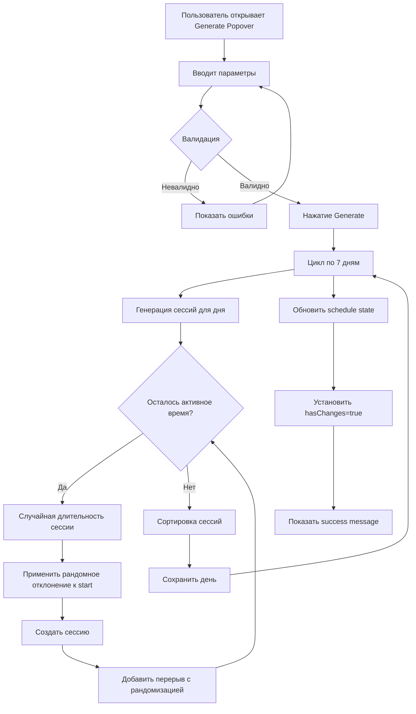

# План реализации системы генерации расписания

## 1. Интерфейс параметров генерации

### ScheduleGenerationParams (types/index.ts)

```typescript
// Параметры генерации расписания
export interface ScheduleGenerationParams {
  /** Время начала фарма (HH:MM) */
  startTime: string;
  /** Время конца фарма (HH:MM) */
  endTime: string;
  /** Целевое время активности в дне (минуты) */
  targetActiveMinutes: number;
  /** Минимальное время активной сессии (минуты) */
  minSessionMinutes: number;
  /** Минимальное время отдыха между сессиями (минуты) */
  minBreakMinutes: number;
  /** Рандомное отклонение ± (минуты) */
  randomOffsetMinutes: number;
  /** Профиль для сессий (опционально) */
  profile?: string;
}

// Результат генерации
export interface GeneratedSchedule {
  days: {
    "0": ScheduleDay;
    "1": ScheduleDay;
    "2": ScheduleDay;
    "3": ScheduleDay;
    "4": ScheduleDay;
    "5": ScheduleDay;
    "6": ScheduleDay;
  };
}
```

---

## 2. Алгоритм генерации сессий

### Основная функция (utils/scheduleUtils.ts)

```typescript
/**
 * Генерирует расписание на основе параметров
 */
export function generateSchedule(
  params: ScheduleGenerationParams
): GeneratedSchedule {
  const days: GeneratedSchedule['days'] = {
    "0": { enabled: true, sessions: [] },
    "1": { enabled: true, sessions: [] },
    "2": { enabled: true, sessions: [] },
    "3": { enabled: true, sessions: [] },
    "4": { enabled: true, sessions: [] },
    "5": { enabled: true, sessions: [] },
    "6": { enabled: true, sessions: [] }
  };

  // Генерируем для каждого дня недели
  for (let day = 0; day <= 6; day++) {
    const dayKey = day.toString() as keyof typeof days;
    days[dayKey] = generateDaySchedule(params);
  }

  return { days };
}

/**
 * Генерирует расписание для одного дня
 */
function generateDaySchedule(
  params: ScheduleGenerationParams
): ScheduleDay {
  const {
    startTime,
    endTime,
    targetActiveMinutes,
    minSessionMinutes,
    minBreakMinutes,
    randomOffsetMinutes,
    profile = 'farming'
  } = params;

  const sessions: ScheduleSession[] = [];
  
  // Конвертируем время в минуты
  const windowStart = timeToMinutes(startTime);
  const windowEnd = timeToMinutes(endTime);
  const windowDuration = windowEnd - windowStart;
  
  // Проверяем валидность параметров
  if (windowDuration <= 0) {
    return { enabled: false, sessions: [] };
  }
  
  if (targetActiveMinutes > windowDuration) {
    return { enabled: false, sessions: [] };
  }

  let currentTime = windowStart;
  let remainingActiveMinutes = targetActiveMinutes;

  // Генерируем сессии пока не достигнем целевого времени активности
  while (remainingActiveMinutes > 0) {
    // Рассчитываем максимально возможную длительность сессии
    const timeLeftInWindow = windowEnd - currentTime;
    const minRequiredTime = minSessionMinutes + minBreakMinutes;
    
    // Проверяем, хватит ли времени на ещё одну сессию + перерыв
    if (timeLeftInWindow < minSessionMinutes) {
      break;
    }

    // Определяем длительность сессии
    let sessionDuration: number;
    
    if (remainingActiveMinutes <= minSessionMinutes) {
      // Последняя сессия - используем оставшееся время
      sessionDuration = remainingActiveMinutes;
    } else {
      // Случайная длительность от minSessionMinutes до оставшегося времени
      // но не больше чем 50% от оставшегося времени активности (для баланса)
      const maxSessionDuration = Math.min(
        remainingActiveMinutes - minSessionMinutes, // Оставляем место для минимум ещё одной сессии
        Math.floor(remainingActiveMinutes * 0.7),   // Не более 70% от оставшегося
        240 // Максимум 4 часа на сессию
      );
      
      sessionDuration = randomInt(minSessionMinutes, Math.max(minSessionMinutes, maxSessionDuration));
    }

    // Применяем рандомное отклонение к времени начала
    const startOffset = randomInt(-randomOffsetMinutes, randomOffsetMinutes);
    const sessionStart = Math.max(windowStart, currentTime + startOffset);
    
    // Рассчитываем время окончания
    let sessionEnd = sessionStart + sessionDuration;
    
    // Проверяем, что сессия укладывается в окно
    if (sessionEnd > windowEnd) {
      sessionEnd = windowEnd;
      sessionDuration = sessionEnd - sessionStart;
      
      // Если сессия стала слишком короткой, пропускаем
      if (sessionDuration < minSessionMinutes) {
        break;
      }
    }

    // Создаём сессию
    sessions.push({
      id: generateSessionId(),
      start: minutesToTime(sessionStart),
      end: minutesToTime(sessionEnd),
      enabled: true,
      profile,
      type: 'active'
    });

    // Обновляем оставшееся время активности
    remainingActiveMinutes -= sessionDuration;

    // Рассчитываем время для следующей сессии (с перерывом)
    if (remainingActiveMinutes > 0) {
      // Длительность перерыва с рандомизацией
      const breakDuration = minBreakMinutes + randomInt(0, randomOffsetMinutes);
      currentTime = sessionEnd + breakDuration;
      
      // Проверяем, хватит ли времени на следующую сессию
      if (currentTime + minSessionMinutes > windowEnd) {
        break;
      }
    }
  }

  // Если не удалось сгенерировать достаточно активности, добавляем одну большую сессию
  if (sessions.length === 0 && targetActiveMinutes > 0) {
    const sessionStart = windowStart + randomInt(0, randomOffsetMinutes);
    const sessionEnd = Math.min(windowEnd, sessionStart + targetActiveMinutes);
    
    if (sessionEnd - sessionStart >= minSessionMinutes) {
      sessions.push({
        id: generateSessionId(),
        start: minutesToTime(sessionStart),
        end: minutesToTime(sessionEnd),
        enabled: true,
        profile,
        type: 'active'
      });
    }
  }

  return {
    enabled: sessions.length > 0,
    sessions: sortSessions(sessions)
  };
}

/**
 * Генерирует случайное целое число в диапазоне [min, max]
 */
function randomInt(min: number, max: number): number {
  return Math.floor(Math.random() * (max - min + 1)) + min;
}
```

---

## 3. UI компонент ScheduleGenerator

### Структура компонента

```typescript
// components/schedule/ScheduleGenerator.tsx
import React, { useState, useCallback } from 'react';
import { Button, InputNumber, TimePicker, Form, Space, Tooltip, Popover } from 'antd';
import { SettingOutlined, ThunderboltOutlined } from '@ant-design/icons';
import type { ScheduleGenerationParams } from '../../types';
import { timeToMinutes, minutesToTime } from '../../utils/scheduleUtils';
import dayjs from 'dayjs';
import './ScheduleGenerator.css';

interface ScheduleGeneratorProps {
  onGenerate: (params: ScheduleGenerationParams) => void;
  disabled?: boolean;
}

// Дефолтные значения параметров
const DEFAULT_PARAMS: ScheduleGenerationParams = {
  startTime: '09:00',
  endTime: '23:00',
  targetActiveMinutes: 480, // 8 часов
  minSessionMinutes: 60,    // 1 час
  minBreakMinutes: 30,      // 30 минут
  randomOffsetMinutes: 15,  // ±15 минут
  profile: 'farming'
};

// Ограничения для валидации
const CONSTRAINTS = {
  minSessionMinutes: { min: 15, max: 240 },
  minBreakMinutes: { min: 5, max: 120 },
  randomOffsetMinutes: { min: 0, max: 60 },
  targetActiveMinutes: { min: 30, max: 1380 } // 30 мин - 23 часа
};

export const ScheduleGenerator: React.FC<ScheduleGeneratorProps> = ({
  onGenerate,
  disabled = false
}) => {
  const [isOpen, setIsOpen] = useState(false);
  const [params, setParams] = useState<ScheduleGenerationParams>(DEFAULT_PARAMS);
  const [errors, setErrors] = useState<Record<string, string>>({});

  // Валидация параметров
  const validateParams = useCallback((): boolean => {
    const newErrors: Record<string, string> = {};
    
    const windowStart = timeToMinutes(params.startTime);
    const windowEnd = timeToMinutes(params.endTime);
    const windowDuration = windowEnd - windowStart;
    
    if (windowDuration <= 0) {
      newErrors.endTime = 'End time must be after start time';
    }
    
    if (params.targetActiveMinutes > windowDuration) {
      newErrors.targetActiveMinutes = `Cannot exceed window duration (${windowDuration} min)`;
    }
    
    if (params.minSessionMinutes < CONSTRAINTS.minSessionMinutes.min) {
      newErrors.minSessionMinutes = `Minimum ${CONSTRAINTS.minSessionMinutes.min} minutes`;
    }
    
    if (params.minSessionMinutes > CONSTRAINTS.minSessionMinutes.max) {
      newErrors.minSessionMinutes = `Maximum ${CONSTRAINTS.minSessionMinutes.max} minutes`;
    }
    
    if (params.minBreakMinutes < CONSTRAINTS.minBreakMinutes.min) {
      newErrors.minBreakMinutes = `Minimum ${CONSTRAINTS.minBreakMinutes.min} minutes`;
    }
    
    if (params.randomOffsetMinutes > CONSTRAINTS.randomOffsetMinutes.max) {
      newErrors.randomOffsetMinutes = `Maximum ${CONSTRAINTS.randomOffsetMinutes.max} minutes`;
    }
    
    setErrors(newErrors);
    return Object.keys(newErrors).length === 0;
  }, [params]);

  // Обработчик генерации
  const handleGenerate = useCallback(() => {
    if (!validateParams()) return;
    
    onGenerate(params);
    setIsOpen(false);
  }, [params, validateParams, onGenerate]);

  // Обновление параметра
  const updateParam = useCallback(<K extends keyof ScheduleGenerationParams>(
    key: K,
    value: ScheduleGenerationParams[K]
  ) => {
    setParams(prev => ({ ...prev, [key]: value }));
    // Очищаем ошибку для этого поля
    if (errors[key]) {
      setErrors(prev => { const next = { ...prev }; delete next[key]; return next; });
    }
  }, [errors]);

  // Контент поповера с параметрами
  const popoverContent = (
    <div className="schedule-generator-form">
      <Form layout="vertical" size="small">
        <div className="generator-row">
          <Form.Item 
            label="Farm Start" 
            validateStatus={errors.startTime ? 'error' : undefined}
            help={errors.startTime}
          >
            <TimePicker
              value={dayjs(params.startTime, 'HH:mm')}
              onChange={(time) => updateParam('startTime', time?.format('HH:mm') || '09:00')}
              format="HH:mm"
              size="small"
            />
          </Form.Item>
          
          <Form.Item 
            label="Farm End"
            validateStatus={errors.endTime ? 'error' : undefined}
            help={errors.endTime}
          >
            <TimePicker
              value={dayjs(params.endTime, 'HH:mm')}
              onChange={(time) => updateParam('endTime', time?.format('HH:mm') || '23:00')}
              format="HH:mm"
              size="small"
            />
          </Form.Item>
        </div>

        <Form.Item 
          label={`Target Active Time: ${params.targetActiveMinutes} min (${Math.floor(params.targetActiveMinutes / 60)}h ${params.targetActiveMinutes % 60}m)`}
          validateStatus={errors.targetActiveMinutes ? 'error' : undefined}
          help={errors.targetActiveMinutes}
        >
          <InputNumber
            min={CONSTRAINTS.targetActiveMinutes.min}
            max={CONSTRAINTS.targetActiveMinutes.max}
            value={params.targetActiveMinutes}
            onChange={(value) => updateParam('targetActiveMinutes', value || 480)}
            size="small"
            style={{ width: '100%' }}
            step={15}
          />
        </Form.Item>

        <div className="generator-row">
          <Form.Item 
            label="Min Session"
            validateStatus={errors.minSessionMinutes ? 'error' : undefined}
            help={errors.minSessionMinutes}
          >
            <InputNumber
              min={CONSTRAINTS.minSessionMinutes.min}
              max={CONSTRAINTS.minSessionMinutes.max}
              value={params.minSessionMinutes}
              onChange={(value) => updateParam('minSessionMinutes', value || 60)}
              size="small"
              addonAfter="min"
            />
          </Form.Item>
          
          <Form.Item 
            label="Min Break"
            validateStatus={errors.minBreakMinutes ? 'error' : undefined}
            help={errors.minBreakMinutes}
          >
            <InputNumber
              min={CONSTRAINTS.minBreakMinutes.min}
              max={CONSTRAINTS.minBreakMinutes.max}
              value={params.minBreakMinutes}
              onChange={(value) => updateParam('minBreakMinutes', value || 30)}
              size="small"
              addonAfter="min"
            />
          </Form.Item>
        </div>

        <Form.Item 
          label={`Random Offset: ±${params.randomOffsetMinutes} min`}
          validateStatus={errors.randomOffsetMinutes ? 'error' : undefined}
          help={errors.randomOffsetMinutes}
        >
          <InputNumber
            min={CONSTRAINTS.randomOffsetMinutes.min}
            max={CONSTRAINTS.randomOffsetMinutes.max}
            value={params.randomOffsetMinutes}
            onChange={(value) => updateParam('randomOffsetMinutes', value || 0)}
            size="small"
            style={{ width: '100%' }}
            addonAfter="min"
          />
        </Form.Item>

        <Space className="generator-actions">
          <Button size="small" onClick={() => setParams(DEFAULT_PARAMS)}>
            Reset
          </Button>
          <Button 
            type="primary" 
            size="small" 
            icon={<ThunderboltOutlined />}
            onClick={handleGenerate}
          >
            Generate
          </Button>
        </Space>
      </Form>
    </div>
  );

  return (
    <Popover
      content={popoverContent}
      title="Schedule Generator Settings"
      trigger="click"
      open={isOpen}
      onOpenChange={setIsOpen}
      placement="bottomRight"
    >
      <Button
        icon={<SettingOutlined />}
        size="small"
        disabled={disabled}
      >
        Generate
      </Button>
    </Popover>
  );
};
```

### Стили (ScheduleGenerator.css)

```css
.schedule-generator-form {
  width: 320px;
}

.generator-row {
  display: flex;
  gap: 12px;
}

.generator-row .ant-form-item {
  flex: 1;
  margin-bottom: 12px;
}

.schedule-generator-form .ant-form-item {
  margin-bottom: 12px;
}

.schedule-generator-form .ant-form-item-label {
  padding-bottom: 4px;
}

.schedule-generator-form .ant-form-item-label label {
  color: var(--proxmox-text-secondary);
  font-size: 12px;
}

.generator-actions {
  display: flex;
  justify-content: flex-end;
  width: 100%;
  margin-top: 8px;
  padding-top: 12px;
  border-top: 1px solid var(--proxmox-border);
}
```

---

## 4. Интеграция с BotSchedule.tsx

### Модификация BotSchedule.tsx

```typescript
// Добавить импорты
import { ThunderboltOutlined } from '@ant-design/icons';
import { ScheduleGenerator } from '../schedule/ScheduleGenerator';
import { generateSchedule } from '../../utils/scheduleUtils';

// Внутри компонента добавить обработчик
const handleGenerateSchedule = useCallback((params: ScheduleGenerationParams) => {
  const generated = generateSchedule(params);
  
  setSchedule(prev => {
    if (!prev) return prev;
    return {
      ...prev,
      days: generated.days,
      updated_at: Date.now()
    };
  });
  setHasChanges(true);
  message.success('Schedule generated for all 7 days');
}, []);

// В JSX добавить кнопку Generate в extra Card
extra={
  <div className="schedule-actions">
    <ScheduleGenerator 
      onGenerate={handleGenerateSchedule}
      disabled={loading}
    />
    <Button
      icon={<ReloadOutlined />}
      size="small"
      onClick={handleReset}
      disabled={!hasChanges}
    >
      Reset
    </Button>
    <Button
      type="primary"
      icon={<SaveOutlined />}
      size="small"
      onClick={handleSave}
      disabled={!hasChanges}
    >
      Save
    </Button>
  </div>
}
```

---

## 5. Валидация параметров

### Правила валидации

| Параметр | Мин | Макс | Правило |
|----------|-----|------|---------|
| startTime | 00:00 | 23:59 | Должно быть меньше endTime |
| endTime | 00:00 | 23:59 | Должно быть больше startTime |
| targetActiveMinutes | 30 | 1380 | Не может превышать длительность окна |
| minSessionMinutes | 15 | 240 | Минимум 15 минут |
| minBreakMinutes | 5 | 120 | Минимум 5 минут |
| randomOffsetMinutes | 0 | 60 | Не более 60 минут |

### Дополнительные проверки

1. **Окно времени**: `endTime - startTime > minSessionMinutes`
2. **Достижимость цели**: `targetActiveMinutes <= (endTime - startTime) * 0.9` (90% от окна)
3. **Минимум сессий**: `targetActiveMinutes / minSessionMinutes >= 1`
4. **Перерывы**: `(targetActiveMinutes / minSessionMinutes - 1) * minBreakMinutes < (endTime - startTime - targetActiveMinutes)`

---

## 6. Mermaid диаграмма потока генерации



---

## 7. Todo для реализации

- [ ] Добавить ScheduleGenerationParams и GeneratedSchedule в types/index.ts
- [ ] Добавить функции generateSchedule, generateDaySchedule, randomInt в utils/scheduleUtils.ts
- [ ] Создать компонент ScheduleGenerator.tsx
- [ ] Создать стили ScheduleGenerator.css
- [ ] Модифицировать BotSchedule.tsx для интеграции
- [ ] Обновить экспорты в components/schedule/index.ts
- [ ] Протестировать генерацию с разными параметрами
