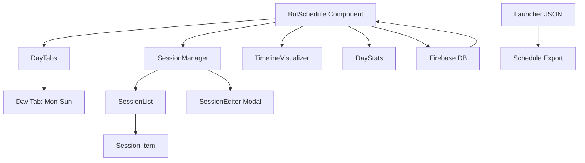

# План реализации системы расписания

## Обзор
Создание гибкой системы расписания для ботов с поддержкой множественных сессий, визуализацией и интеграцией с Firebase.

---

## Архитектура системы



---

## Задачи реализации

### 1. Обновление типов TypeScript
**Файл:** `bot-mox/src/types/index.ts`

- [ ] Добавить интерфейс `ScheduleSession`
- [ ] Добавить интерфейс `ScheduleDay`
- [ ] Добавить интерфейс `BotScheduleV2`
- [ ] Обновить интерфейс `Bot` для поддержки нового расписания
- [ ] Добавить типы для валидации

**Пример кода:**
```typescript
export interface ScheduleSession {
  id: string;
  start: string;        // HH:MM
  end: string;          // HH:MM
  enabled: boolean;
  profile?: string;
  type: 'active' | 'break';
}

export interface ScheduleDay {
  enabled: boolean;
  sessions: ScheduleSession[];
}

export interface BotScheduleV2 {
  version: number;
  timezone: string;
  days: Record<string, ScheduleDay>;
  updated_at: number;
}
```

---

### 2. Утилиты для работы с расписанием
**Файл:** `bot-mox/src/utils/scheduleUtils.ts` (новый)

- [ ] Функция `createEmptySchedule()` - создание пустого расписания
- [ ] Функция `migrateSchedule()` - миграция со старого формата
- [ ] Функция `validateSessions()` - валидация сессий
- [ ] Функция `sortSessions()` - сортировка по времени
- [ ] Функция `timeToMinutes()` - конвертация HH:MM в минуты
- [ ] Функция `minutesToTime()` - конвертация минут в HH:MM
- [ ] Функция `calculateDayStats()` - расчет статистики дня
- [ ] Функция `generateScheduleForLauncher()` - генерация JSON для лаунчера
- [ ] Функция `getWeekDates()` - получение дат текущей недели

---

### 3. UI Компоненты

#### 3.1 DayTabs Component
**Файл:** `bot-mox/src/components/schedule/DayTabs.tsx` (новый)

- [ ] Отображение 7 вкладок (Mon-Sun)
- [ ] Показ даты для каждого дня
- [ ] Индикатор наличия сессий
- [ ] Индикатор enabled/disabled состояния
- [ ] Обработка переключения вкладок

**Props:**
```typescript
interface DayTabsProps {
  selectedDay: number;
  onDayChange: (day: number) => void;
  days: Record<string, ScheduleDay>;
  weekDates: Date[];
}
```

#### 3.2 SessionList Component
**Файл:** `bot-mox/src/components/schedule/SessionList.tsx` (новый)

- [ ] Отображение списка сессий
- [ ] Кнопка добавления новой сессии
- [ ] Кнопки редактирования/удаления
- [ ] Toggle enabled/disabled
- [ ] Пустое состояние (placeholder)

**Props:**
```typescript
interface SessionListProps {
  sessions: ScheduleSession[];
  onAdd: () => void;
  onEdit: (session: ScheduleSession) => void;
  onDelete: (id: string) => void;
  onToggle: (id: string, enabled: boolean) => void;
}
```

#### 3.3 SessionEditor Modal
**Файл:** `bot-mox/src/components/schedule/SessionEditor.tsx` (новый)

- [ ] TimePicker для start/end
- [ ] Select для profile
- [ ] Toggle для enabled
- [ ] Валидация времени
- [ ] Предупреждение о пересечениях
- [ ] Кнопки Save/Cancel

**Props:**
```typescript
interface SessionEditorProps {
  session?: ScheduleSession;
  existingSessions: ScheduleSession[];
  visible: boolean;
  onSave: (session: ScheduleSession) => void;
  onCancel: () => void;
}
```

#### 3.4 TimelineVisualizer Component
**Файл:** `bot-mox/src/components/schedule/TimelineVisualizer.tsx` (новый)

- [ ] Отображение 24-часовой шкалы
- [ ] Цветные блоки для активных сессий
- [ ] Подписи времени
- [ ] Легенда (Sleep/Work/Break)
- [ ] Текущее время (опционально)

**Props:**
```typescript
interface TimelineVisualizerProps {
  sessions: ScheduleSession[];
  dayEnabled: boolean;
}
```

#### 3.5 DayStats Component
**Файл:** `bot-mox/src/components/schedule/DayStats.tsx` (новый)

- [ ] Общее время активности
- [ ] Общее время перерывов
- [ ] Количество сессий
- [ ] Процент от 24 часов

**Props:**
```typescript
interface DayStatsProps {
  sessions: ScheduleSession[];
}
```

---

### 4. Основной компонент BotSchedule
**Файл:** `bot-mox/src/components/bot/BotSchedule.tsx` (переписать)

- [ ] Интеграция с Firebase
- [ ] Загрузка расписания бота
- [ ] Сохранение изменений
- [ ] Обработка состояния загрузки
- [ ] Обработка ошибок
- [ ] Миграция старых данных
- [ ] Интеграция всех sub-компонентов

**Структура:**
```typescript
const BotSchedule: React.FC<BotScheduleProps> = ({ botId }) => {
  const [schedule, setSchedule] = useState<BotScheduleV2 | null>(null);
  const [selectedDay, setSelectedDay] = useState(1); // Monday
  const [editingSession, setEditingSession] = useState<ScheduleSession | null>(null);
  const [isEditorOpen, setIsEditorOpen] = useState(false);
  
  // Firebase integration
  // Handlers
  // Render
};
```

---

### 5. Стили
**Файл:** `bot-mox/src/components/bot/BotSchedule.css` (переписать)

- [ ] Стили для DayTabs
- [ ] Стили для SessionList
- [ ] Стили для TimelineVisualizer
- [ ] Адаптивность
- [ ] Темная тема (Proxmox style)

---

### 6. Обновление DATABASE_SCHEMA.json
**Файл:** `DATABASE_SCHEMA.json`

- [ ] Обновить секцию `bots.schedule`
- [ ] Добавить примеры нового формата
- [ ] Добавить описание миграции

---

## Порядок реализации

### Фаза 1: Фундамент
1. Обновить типы (`types/index.ts`)
2. Создать утилиты (`utils/scheduleUtils.ts`)
3. Обновить схему БД (`DATABASE_SCHEMA.json`)

### Фаза 2: UI Компоненты
4. Создать DayTabs
5. Создать SessionList
6. Создать SessionEditor
7. Создать TimelineVisualizer
8. Создать DayStats

### Фаза 3: Интеграция
9. Переписать BotSchedule.tsx
10. Обновить стили
11. Тестирование

### Фаза 4: Дополнительно
12. Миграция существующих данных
13. Экспорт для лаунчера
14. Документация

---

## Пример использования

### Создание расписания (4 сессии по 2.5 часа):
```typescript
const schedule: BotScheduleV2 = {
  version: 2,
  timezone: "Europe/Moscow",
  days: {
    "1": {
      enabled: true,
      sessions: [
        { id: "1", start: "09:00", end: "11:30", enabled: true, profile: "farming", type: "active" },
        { id: "2", start: "12:00", end: "14:30", enabled: true, profile: "farming", type: "active" },
        { id: "3", start: "15:00", end: "17:30", enabled: true, profile: "farming", type: "active" },
        { id: "4", start: "18:00", end: "20:30", enabled: true, profile: "farming", type: "active" },
      ]
    },
    // ... other days
  },
  updated_at: Date.now()
};
```

### Сохранение в Firebase:
```typescript
import { ref, set } from 'firebase/database';
import { database } from '../utils/firebase';

const saveSchedule = async (botId: string, schedule: BotScheduleV2) => {
  const scheduleRef = ref(database, `bots/${botId}/schedule`);
  await set(scheduleRef, {
    ...schedule,
    updated_at: Date.now()
  });
};
```

---

## Тестирование

### Сценарии:
1. Создание нового расписания с нуля
2. Добавление/удаление сессий
3. Редактирование времени сессии
4. Проверка валидации (пересечения)
5. Миграция старых данных
6. Сохранение/загрузка из Firebase
7. Визуализация таймлайна

### Edge cases:
- Пустое расписание
- Все сессии disabled
- Пересечение сессий (должно блокироваться)
- Сессия за пределами 24 часов
- Переход через полночь
