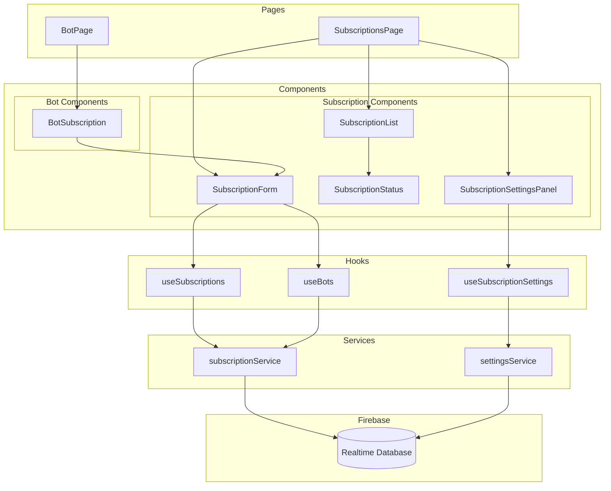
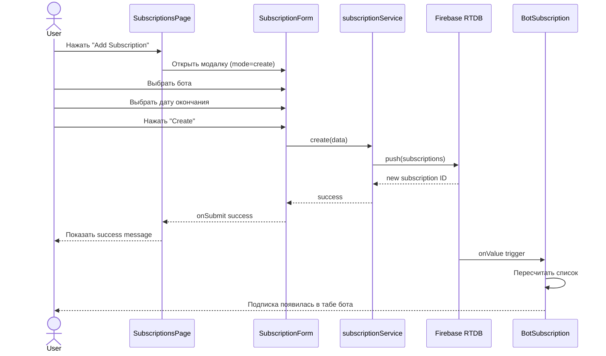
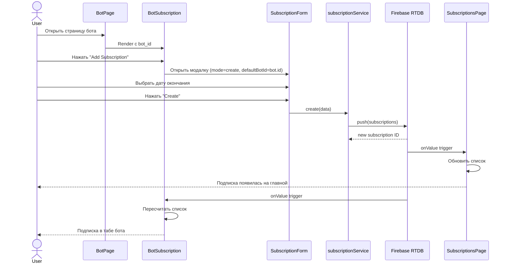
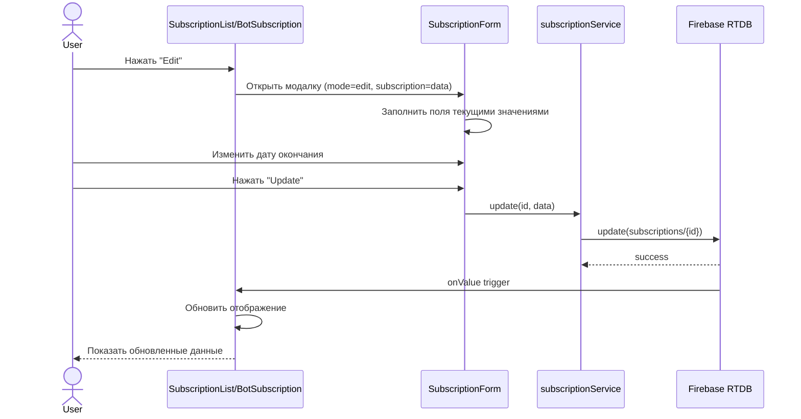
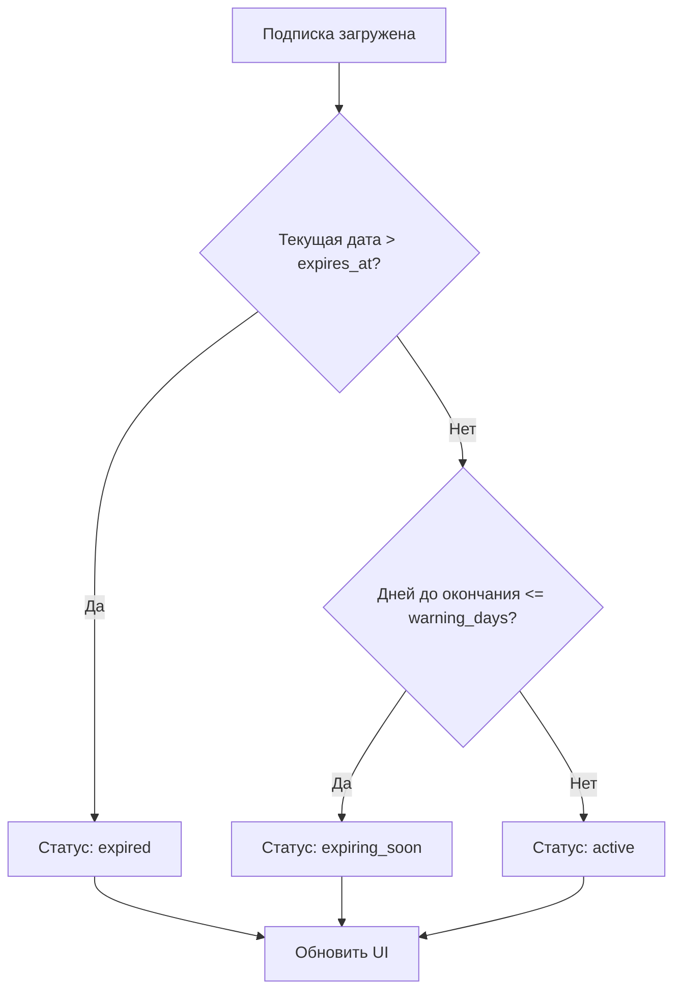

# Архитектура системы подписок Bot-Mox

## Обзор

Этот документ описывает архитектуру новой системы подписок для проекта Bot-Mox, которая позволяет:
- Добавлять подписки с главной страницы и со страницы бота
- Автоматически рассчитывать статус подписки
- Настраивать предупреждения о скором окончании
- Редактировать подписки из разных мест

---

## 1. Обновленные TypeScript типы

### 1.1 Subscription типы

```typescript
// bot-mox/src/types/index.ts

// Типы подписок
export type SubscriptionType = 'wow' | 'bot' | 'proxy' | 'vpn' | 'other';

// Статусы подписки (вычисляемые)
export type ComputedSubscriptionStatus = 'active' | 'expiring_soon' | 'expired';

// Статусы в БД
export type SubscriptionDbStatus = 'active' | 'cancelled';

// Интерфейс подписки
export interface Subscription {
  id: string;
  type: SubscriptionType;
  // Статус в БД - active или cancelled (expired вычисляется)
  status: SubscriptionDbStatus;
  expires_at: number;      // timestamp окончания
  created_at: number;      // timestamp создания
  updated_at: number;      // timestamp обновления
  
  // Обязательная привязка к боту
  bot_id: string;
  
  // Опциональная привязка к аккаунту (для wow подписок)
  account_email?: string;
  
  // Автопродление
  auto_renew?: boolean;
  
  // Проект (для wow подписок)
  project_id?: 'wow_tbc' | 'wow_midnight';
  
  // Описание/заметки
  notes?: string;
}

// Расширенный интерфейс для UI
export interface SubscriptionWithDetails extends Subscription {
  // Вычисляемые поля
  computedStatus: ComputedSubscriptionStatus;
  daysRemaining: number;
  isExpired: boolean;
  isExpiringSoon: boolean;
  
  // Данные бота
  botName?: string;
  botCharacter?: string;
  botStatus?: BotStatus;
}

// Настройки приложения для подписок
export interface SubscriptionSettings {
  // За сколько дней показывать предупреждение
  warning_days: number;
  updated_at: number;
  updated_by?: string;
}

// Расширенный AppSettings
export interface AppSettings {
  // ... существующие поля ...
  
  subscriptions: SubscriptionSettings;
}

// Сводка по подпискам
export interface SubscriptionSummary {
  total: number;
  active: number;
  expired: number;
  expiring_soon: number;
  by_type: Record<SubscriptionType, {
    total: number;
    active: number;
    expired: number;
  }>;
  expiring_items: Array<{
    id: string;
    bot_id: string;
    type: SubscriptionType;
    expires_at: number;
    days_remaining: number;
  }>;
  last_updated: number;
}
```

### 1.2 Props для компонентов

```typescript
// Props для формы подписки
interface SubscriptionFormProps {
  // Режим работы
  mode: 'create' | 'edit';
  
  // Существующая подписка (для редактирования)
  subscription?: Subscription;
  
  // Предзаполненный bot_id (когда создаем со страницы бота)
  defaultBotId?: string;
  
  // Список доступных ботов для выбора
  availableBots: Array<{
    id: string;
    name: string;
    character?: string;
    status: BotStatus;
  }>;
  
  // Настройки
  settings: SubscriptionSettings;
  
  // Callbacks
  onSubmit: (data: SubscriptionFormData) => Promise<void>;
  onCancel: () => void;
}

// Данные формы
interface SubscriptionFormData {
  bot_id: string;
  type: SubscriptionType;
  expires_at: number;  // timestamp
  account_email?: string;
  auto_renew?: boolean;
  notes?: string;
}

// Props для списка подписок
interface SubscriptionListProps {
  subscriptions: SubscriptionWithDetails[];
  loading: boolean;
  settings: SubscriptionSettings;
  onEdit: (sub: Subscription) => void;
  onDelete: (sub: Subscription) => void;
  filters?: {
    botId?: string;
    type?: SubscriptionType;
    status?: ComputedSubscriptionStatus;
  };
}

// Props для компонента статуса
interface SubscriptionStatusProps {
  subscription: Subscription;
  settings: SubscriptionSettings;
  showIcon?: boolean;
  showText?: boolean;
}

// Props для панели настроек
interface SubscriptionSettingsPanelProps {
  settings: SubscriptionSettings;
  onSave: (settings: SubscriptionSettings) => Promise<void>;
}
```

---

## 2. Обновленная схема DATABASE_SCHEMA.json

```json
{
  "subscriptions": {
    "_description": "Подписки ботов (WoW, Bot software, Proxy, VPN)",
    "_schema": {
      "$subscription_id": {
        "id": "string - уникальный ID подписки",
        "type": "string - тип подписки: wow | bot | proxy | vpn | other",
        "status": "string - статус в БД: active | cancelled",
        "expires_at": "number - timestamp окончания подписки",
        "created_at": "number - timestamp создания",
        "updated_at": "number - timestamp обновления",
        "bot_id": "string - ID бота (обязательное поле)",
        "account_email": "string | null - email аккаунта (для wow подписок)",
        "auto_renew": "boolean - автопродление",
        "project_id": "string | null - wow_tbc | wow_midnight",
        "notes": "string | null - заметки"
      }
    },
    "_example": {
      "sub_001": {
        "id": "sub_001",
        "type": "wow",
        "status": "active",
        "expires_at": 1735689600000,
        "created_at": 1704067200000,
        "updated_at": 1704067200000,
        "bot_id": "550e8400-e29b-41d4-a716-446655440001",
        "account_email": "wowbot101@example.com",
        "auto_renew": true,
        "project_id": "wow_tbc",
        "notes": "Monthly subscription"
      },
      "sub_002": {
        "id": "sub_002",
        "type": "bot",
        "status": "active",
        "expires_at": 1738368000000,
        "created_at": 1706745600000,
        "updated_at": 1706745600000,
        "bot_id": "550e8400-e29b-41d4-a716-446655440001",
        "account_email": null,
        "auto_renew": false,
        "project_id": null,
        "notes": "SIN license"
      }
    },
    "_indexes": [
      "bot_id - для быстрого поиска подписок бота",
      "expires_at - для поиска истекающих подписок"
    ],
    "_validation": {
      "bot_id_required": "bot_id обязателен для всех подписок",
      "expires_at_future": "expires_at должен быть в будущем при создании"
    }
  },

  "subscriptions_summary": {
    "_description": "Агрегированная статистика по подпискам (обновляется триггером)",
    "_schema": {
      "total": "number - всего подписок",
      "active": "number - активных (не истекших)",
      "expired": "number - истекших",
      "expiring_soon": "number - истекающих в ближайшие N дней",
      "by_type": {
        "$type": {
          "total": "number",
          "active": "number",
          "expired": "number"
        }
      },
      "expiring_items": {
        "$index": {
          "id": "string - ID подписки",
          "bot_id": "string - ID бота",
          "type": "string - тип подписки",
          "expires_at": "number - timestamp окончания",
          "days_remaining": "number - дней до окончания"
        }
      },
      "last_updated": "number - timestamp обновления"
    },
    "_example": {
      "total": 25,
      "active": 20,
      "expired": 3,
      "expiring_soon": 2,
      "by_type": {
        "wow": { "total": 15, "active": 13, "expired": 2 },
        "bot": { "total": 8, "active": 7, "expired": 1 },
        "proxy": { "total": 2, "active": 2, "expired": 0 }
      },
      "expiring_items": {
        "0": {
          "id": "sub_003",
          "bot_id": "550e8400-e29b-41d4-a716-446655440002",
          "type": "wow",
          "expires_at": 1709251200000,
          "days_remaining": 3
        }
      },
      "last_updated": 1709251200000
    }
  },

  "app_settings": {
    "_description": "Настройки приложения",
    "_schema": {
      "...": "...",
      "subscriptions": {
        "warning_days": "number - за сколько дней предупреждать об окончании (по умолчанию 7)",
        "updated_at": "number - timestamp обновления",
        "updated_by": "string - кем обновлено"
      }
    },
    "_example": {
      "subscriptions": {
        "warning_days": 7,
        "updated_at": 1709251200000,
        "updated_by": "admin_001"
      }
    }
  }
}
```

---

## 3. Архитектура компонентов

### 3.1 Диаграмма компонентов



### 3.2 Описание компонентов

#### SubscriptionForm

**Назначение:** Форма создания/редактирования подписки

**Props:**
```typescript
interface SubscriptionFormProps {
  mode: 'create' | 'edit';
  subscription?: Subscription;
  defaultBotId?: string;
  availableBots: BotOption[];
  settings: SubscriptionSettings;
  onSubmit: (data: SubscriptionFormData) => Promise<void>;
  onCancel: () => void;
  visible: boolean;
}
```

**Особенности:**
- При `defaultBotId` - поле бота disabled и предзаполнено
- Дата в формате ДД.ММ.ГГГГ через DatePicker
- Валидация: bot_id обязателен, expires_at должна быть в будущем

#### SubscriptionList

**Назначение:** Список подписок с фильтрацией и сортировкой

**Props:**
```typescript
interface SubscriptionListProps {
  subscriptions: SubscriptionWithDetails[];
  loading: boolean;
  settings: SubscriptionSettings;
  onEdit: (sub: Subscription) => void;
  onDelete: (sub: Subscription) => void;
  filters?: SubscriptionFilters;
}
```

**Колонки:**
- Статус (с цветовой индикацией)
- Тип подписки
- Бот (имя + персонаж)
- Дата окончания
- Дней осталось
- Действия (редактировать/удалить)

#### SubscriptionStatus

**Назначение:** Отображение вычисляемого статуса подписки

**Логика вычисления статуса:**
```typescript
function computeSubscriptionStatus(
  subscription: Subscription, 
  settings: SubscriptionSettings
): ComputedSubscriptionStatus {
  const now = Date.now();
  const daysRemaining = Math.ceil((subscription.expires_at - now) / (1000 * 60 * 60 * 24));
  
  if (daysRemaining <= 0) return 'expired';
  if (daysRemaining <= settings.warning_days) return 'expiring_soon';
  return 'active';
}
```

**Визуализация:**
- `active` - зеленый цвет, иконка CheckCircle
- `expiring_soon` - оранжевый цвет, иконка ClockCircle
- `expired` - красный цвет, иконка ExclamationCircle

#### SubscriptionSettingsPanel

**Назначение:** Настройка дней до предупреждения

**Props:**
```typescript
interface SubscriptionSettingsPanelProps {
  settings: SubscriptionSettings;
  onSave: (settings: SubscriptionSettings) => Promise<void>;
}
```

**Функционал:**
- Slider или InputNumber для выбора дней (1-30)
- Сохранение в Firebase
- Применение сразу ко всему UI

#### BotSubscription (обновленный)

**Назначение:** Отображение подписок на странице бота

**Обновления:**
- Кнопка "Добавить подписку" открывает SubscriptionForm с `defaultBotId`
- Редактирование даты окончания inline или через модалку
- Синхронизация с главной страницей подписок

---

## 4. Firebase интеграция

### 4.1 Сервис подписок

```typescript
// bot-mox/src/services/subscriptionService.ts

import { ref, onValue, push, set, update, remove, query, orderByChild } from 'firebase/database';
import { database } from '../utils/firebase';
import type { Subscription, SubscriptionFormData } from '../types';

export const subscriptionService = {
  // Получить все подписки
  subscribeToAll(callback: (subs: Subscription[]) => void) {
    const subsRef = ref(database, 'subscriptions');
    return onValue(subsRef, (snapshot) => {
      const data = snapshot.val();
      if (!data) {
        callback([]);
        return;
      }
      const subs = Object.entries(data).map(([id, value]) => ({
        id,
        ...(value as Omit<Subscription, 'id'>),
      }));
      callback(subs);
    });
  },

  // Получить подписки бота
  subscribeToBotSubscriptions(
    botId: string, 
    callback: (subs: Subscription[]) => void
  ) {
    const subsRef = ref(database, 'subscriptions');
    return onValue(subsRef, (snapshot) => {
      const data = snapshot.val();
      if (!data) {
        callback([]);
        return;
      }
      const subs = Object.entries(data)
        .filter(([_, value]) => (value as Subscription).bot_id === botId)
        .map(([id, value]) => ({
          id,
          ...(value as Omit<Subscription, 'id'>),
        }));
      callback(subs);
    });
  },

  // Создать подписку
  async create(data: SubscriptionFormData): Promise<string> {
    const subsRef = ref(database, 'subscriptions');
    const newRef = push(subsRef);
    const now = Date.now();
    
    await set(newRef, {
      ...data,
      id: newRef.key,
      status: 'active',
      created_at: now,
      updated_at: now,
    });
    
    return newRef.key!;
  },

  // Обновить подписку
  async update(id: string, data: Partial<SubscriptionFormData>): Promise<void> {
    const subRef = ref(database, `subscriptions/${id}`);
    await update(subRef, {
      ...data,
      updated_at: Date.now(),
    });
  },

  // Удалить подписку
  async delete(id: string): Promise<void> {
    const subRef = ref(database, `subscriptions/${id}`);
    await remove(subRef);
  },

  // Получить сводку
  subscribeToSummary(callback: (summary: SubscriptionSummary) => void) {
    const summaryRef = ref(database, 'subscriptions_summary');
    return onValue(summaryRef, (snapshot) => {
      callback(snapshot.val() || null);
    });
  },
};
```

### 4.2 Сервис настроек

```typescript
// bot-mox/src/services/settingsService.ts

import { ref, onValue, update } from 'firebase/database';
import { database } from '../utils/firebase';
import type { SubscriptionSettings } from '../types';

const DEFAULT_SETTINGS: SubscriptionSettings = {
  warning_days: 7,
  updated_at: Date.now(),
};

export const settingsService = {
  // Подписаться на настройки
  subscribeToSettings(callback: (settings: SubscriptionSettings) => void) {
    const settingsRef = ref(database, 'app_settings/subscriptions');
    return onValue(settingsRef, (snapshot) => {
      const data = snapshot.val();
      callback(data || DEFAULT_SETTINGS);
    });
  },

  // Обновить настройки
  async updateSettings(
    settings: Partial<SubscriptionSettings>,
    userId: string
  ): Promise<void> {
    const settingsRef = ref(database, 'app_settings/subscriptions');
    await update(settingsRef, {
      ...settings,
      updated_at: Date.now(),
      updated_by: userId,
    });
  },
};
```

### 4.3 Хук useSubscriptions

```typescript
// bot-mox/src/hooks/useSubscriptions.ts

import { useState, useEffect, useMemo, useCallback } from 'react';
import { subscriptionService } from '../services/subscriptionService';
import type { 
  Subscription, 
  SubscriptionWithDetails, 
  SubscriptionSettings,
  ComputedSubscriptionStatus 
} from '../types';

function computeStatus(
  expiresAt: number, 
  settings: SubscriptionSettings
): ComputedSubscriptionStatus {
  const now = Date.now();
  const daysRemaining = Math.ceil((expiresAt - now) / (1000 * 60 * 60 * 24));
  
  if (daysRemaining <= 0) return 'expired';
  if (daysRemaining <= settings.warning_days) return 'expiring_soon';
  return 'active';
}

export function useSubscriptions(settings: SubscriptionSettings) {
  const [subscriptions, setSubscriptions] = useState<Subscription[]>([]);
  const [loading, setLoading] = useState(true);
  const [error, setError] = useState<Error | null>(null);

  useEffect(() => {
    setLoading(true);
    const unsubscribe = subscriptionService.subscribeToAll(
      (subs) => {
        setSubscriptions(subs);
        setLoading(false);
      },
      (err) => {
        setError(err);
        setLoading(false);
      }
    );
    return unsubscribe;
  }, []);

  // Вычисляем расширенные данные
  const subscriptionsWithDetails: SubscriptionWithDetails[] = useMemo(() => {
    return subscriptions.map(sub => {
      const now = Date.now();
      const daysRemaining = Math.ceil((sub.expires_at - now) / (1000 * 60 * 60 * 24));
      const computedStatus = computeStatus(sub.expires_at, settings);
      
      return {
        ...sub,
        computedStatus,
        daysRemaining,
        isExpired: computedStatus === 'expired',
        isExpiringSoon: computedStatus === 'expiring_soon',
      };
    });
  }, [subscriptions, settings]);

  const createSubscription = useCallback(async (data: SubscriptionFormData) => {
    return subscriptionService.create(data);
  }, []);

  const updateSubscription = useCallback(async (id: string, data: Partial<SubscriptionFormData>) => {
    return subscriptionService.update(id, data);
  }, []);

  const deleteSubscription = useCallback(async (id: string) => {
    return subscriptionService.delete(id);
  }, []);

  return {
    subscriptions: subscriptionsWithDetails,
    loading,
    error,
    createSubscription,
    updateSubscription,
    deleteSubscription,
  };
}
```

---

## 5. Flow данных

### 5.1 Создание подписки с главной страницы



### 5.2 Создание подписки со страницы бота



### 5.3 Редактирование подписки



### 5.4 Автоматический расчет статуса



---

## 6. План миграции

### 6.1 Подготовка

1. **Создать бэкап текущих данных:**
```javascript
// scripts/backup-subscriptions.js
const { database } = require('./firebase-admin');

async function backupSubscriptions() {
  const snapshot = await database.ref('subscriptions').once('value');
  const data = snapshot.val();
  require('fs').writeFileSync(
    `subscriptions-backup-${Date.now()}.json`, 
    JSON.stringify(data, null, 2)
  );
  console.log('Backup created');
}
```

### 6.2 Миграция данных

```javascript
// scripts/migrate-subscriptions-v2.js

async function migrateSubscriptions() {
  const snapshot = await database.ref('subscriptions').once('value');
  const subscriptions = snapshot.val();
  
  for (const [id, sub] of Object.entries(subscriptions)) {
    const updates = {};
    
    // 1. Добавить bot_id если отсутствует
    if (!sub.bot_id) {
      // Для wow подписок - найти бота по account_email
      if (sub.type === 'wow' && sub.account_email) {
        const botSnapshot = await database.ref('bots')
          .orderByChild('account/email')
          .equalTo(sub.account_email)
          .once('value');
        const bots = botSnapshot.val();
        if (bots) {
          updates[`subscriptions/${id}/bot_id`] = Object.keys(bots)[0];
        }
      }
      // Если не нашли - установить placeholder
      if (!updates[`subscriptions/${id}/bot_id`]) {
        updates[`subscriptions/${id}/bot_id`] = 'unknown';
      }
    }
    
    // 2. Обновить статус (expired -> active с проверкой даты)
    if (sub.status === 'expired') {
      updates[`subscriptions/${id}/status`] = 'active';
    }
    
    // 3. Добавить updated_at если отсутствует
    if (!sub.updated_at) {
      updates[`subscriptions/${id}/updated_at`] = sub.created_at || Date.now();
    }
    
    // Применить обновления
    if (Object.keys(updates).length > 0) {
      await database.ref().update(updates);
    }
  }
  
  console.log('Migration completed');
}
```

### 6.3 Добавление настроек

```javascript
// scripts/init-subscription-settings.js

async function initSettings() {
  await database.ref('app_settings/subscriptions').set({
    warning_days: 7,
    updated_at: Date.now(),
    updated_by: 'system'
  });
}
```

### 6.4 Порядок выполнения

1. **Deploy кода:**
   - Обновить типы TypeScript
   - Добавить сервисы
   - Обновить компоненты

2. **Миграция данных:**
   ```bash
   node scripts/backup-subscriptions.js
   node scripts/migrate-subscriptions-v2.js
   node scripts/init-subscription-settings.js
   ```

3. **Проверка:**
   - Проверить отображение на главной странице
   - Проверить отображение в табе бота
   - Проверить создание/редактирование
   - Проверить настройки

4. **Cleanup (опционально):**
   - Удалить subscriptions_summary если не используется
   - Обновить security rules если нужно

---

## 7. Security Rules

```json
{
  "rules": {
    "subscriptions": {
      ".read": "auth != null",
      ".write": "auth != null && auth.token.admin === true",
      "$sub_id": {
        ".validate": "newData.hasChildren(['id', 'type', 'status', 'expires_at', 'bot_id', 'created_at', 'updated_at'])"
      }
    },
    "app_settings": {
      ".read": "auth != null",
      ".write": "auth != null && auth.token.admin === true",
      "subscriptions": {
        ".validate": "newData.hasChildren(['warning_days', 'updated_at'])"
      }
    }
  }
}
```

---

## 8. Дополнительные рекомендации

### 8.1 Оптимизация

- Использовать `shallow queries` для списков
- Кэшировать настройки в localStorage
- Дебаунсить обновления summary

### 8.2 Тестирование

- Unit тесты для computeStatus
- Integration тесты для создания/обновления
- E2E тесты для flow создания с разных страниц

### 8.3 Мониторинг

- Логировать ошибки Firebase
- Отслеживать количество подписок
- Алерты на истекающие подписки
